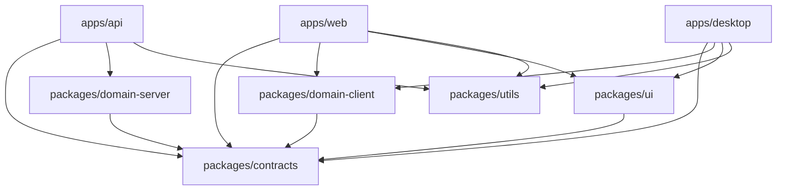
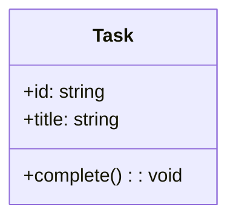
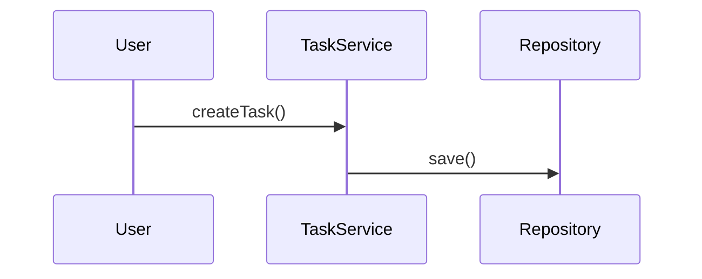
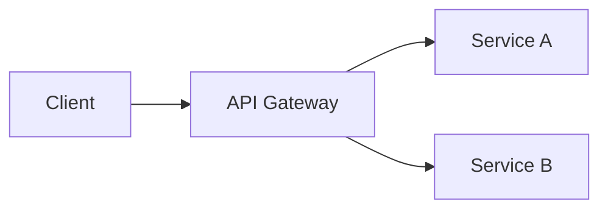
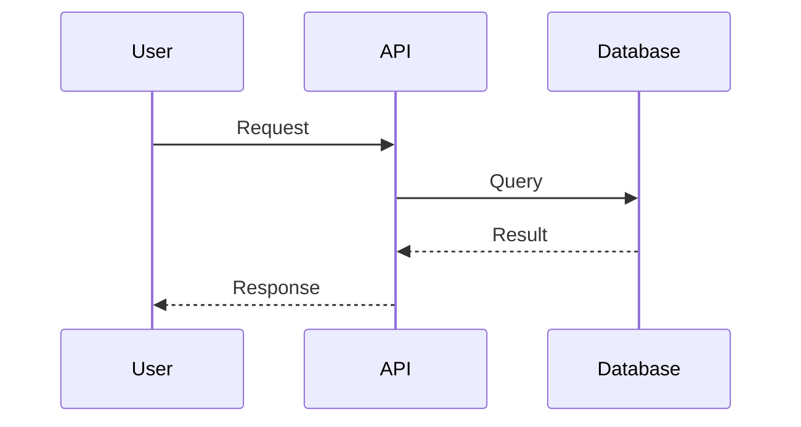
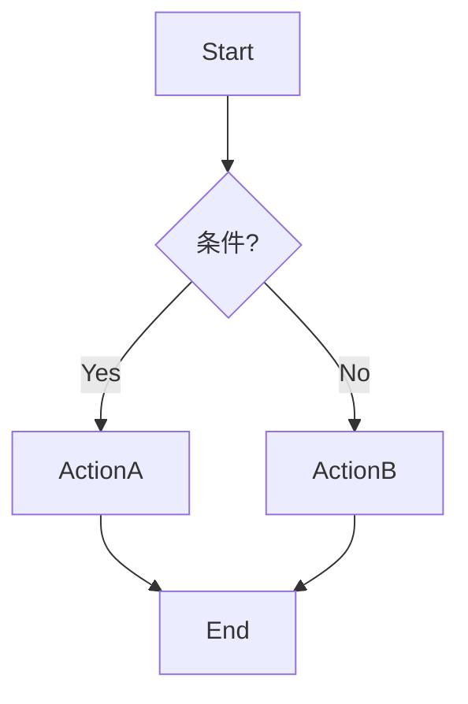
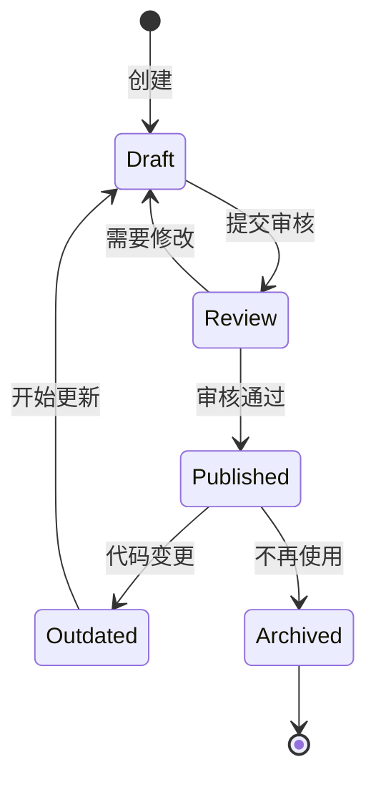
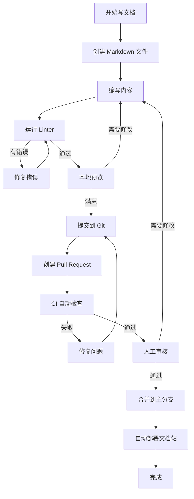

# 项目文档架构最佳实践指南

## 📋 目录

- [1. 概述](#1-概述)
- [2. 文档架构核心原则](#2-文档架构核心原则)
- [3. 目录结构设计](#3-目录结构设计)
- [4. 文档类型与用途](#4-文档类型与用途)
- [5. 文件命名规范](#5-文件命名规范)
- [6. Nx Monorepo 文档架构](#6-nx-monorepo-文档架构)
- [7. 文档内容组织](#7-文档内容组织)
- [8. 文档维护策略](#8-文档维护策略)
- [9. DailyUse 项目实践](#9-dailyuse-项目实践)
- [10. 工具与自动化](#10-工具与自动化)

---

## 1. 概述

### 1.1 什么是好的文档架构？

一个优秀的项目文档架构应该具备以下特征：

- **可发现性** (Discoverability)：用户能够快速找到所需文档
- **可维护性** (Maintainability)：文档易于更新和维护
- **一致性** (Consistency)：统一的结构和命名规范
- **可扩展性** (Scalability)：随项目增长而优雅扩展
- **层次清晰** (Clear Hierarchy)：信息按逻辑层次组织
- **易于导航** (Easy Navigation)：提供多种导航方式

### 1.2 文档架构的重要性

```
良好的文档架构 = 降低学习曲线 + 提高开发效率 + 减少沟通成本
```

**影响范围**：
- 🚀 **新成员上手**：降低 50-70% 的学习时间
- 🔧 **日常开发**：减少 30-40% 的信息查找时间
- 🤝 **团队协作**：提高 60% 的知识共享效率
- 📈 **项目交接**：简化 80% 的交接流程

---

## 2. 文档架构核心原则

### 2.1 金字塔原则

文档应按照重要性和使用频率形成金字塔结构：

```
                    README.md
                   (项目入口)
                  /           \
        Getting Started    Architecture
         (快速开始)          (架构设计)
        /          \        /          \
   Guides      Tutorials  API Docs   References
  (指南集)     (教程)    (API文档)   (参考手册)
```

**层次说明**：

1. **顶层** (L0)：README.md - 项目概览、快速开始
2. **第二层** (L1)：核心文档 - 架构、配置、开发指南
3. **第三层** (L2)：详细文档 - 模块文档、API 文档
4. **底层** (L3)：参考文档 - 技术细节、故障排查

### 2.2 文档生命周期

```
创建 → 审核 → 发布 → 维护 → 归档/删除
```

### 2.3 KISS 原则 (Keep It Simple, Stupid)

- 使用简洁明了的语言
- 避免过度设计的文档结构
- 一个文档只解决一个主题
- 使用图表替代复杂文字描述

### 2.4 DRY 原则 (Don't Repeat Yourself)

- 避免重复内容，使用链接引用
- 单一信息源原则 (Single Source of Truth)
- 使用模板和片段复用常见内容

---

## 3. 目录结构设计

### 3.1 推荐的顶级目录结构

```
project-root/
├── README.md                          # 项目入口文档
├── CONTRIBUTING.md                    # 贡献指南
├── CHANGELOG.md                       # 变更日志
├── LICENSE                            # 许可证
├── .github/                           # GitHub 配置
│   ├── ISSUE_TEMPLATE/               # Issue 模板
│   ├── PULL_REQUEST_TEMPLATE.md      # PR 模板
│   ├── workflows/                    # CI/CD 配置
│   ├── instructions/                 # GitHub Copilot 指令
│   └── prompts/                      # AI 提示词
├── docs/                              # 主文档目录
│   ├── index.md                      # 文档索引
│   ├── getting-started/              # 入门指南
│   ├── architecture/                 # 架构文档
│   ├── guides/                       # 开发指南
│   ├── api/                          # API 文档
│   ├── modules/                      # 模块文档
│   ├── troubleshooting/              # 故障排查
│   └── references/                   # 参考文档
└── [app]/docs/                        # 应用级文档 (可选)
    └── README.md
```

### 3.2 docs/ 目录详细结构

```
docs/
├── index.md                           # 📑 文档总索引 (必须)
├── project-overview.md                # 🏠 项目概览
│
├── getting-started/                   # 🚀 入门指南
│   ├── README.md                     # 入门总览
│   ├── installation.md               # 安装指南
│   ├── quick-start.md                # 快速开始
│   ├── environment-setup.md          # 环境配置
│   └── first-contribution.md         # 第一次贡献
│
├── architecture/                      # 🏗️ 架构文档
│   ├── README.md                     # 架构总览
│   ├── system-design.md              # 系统设计
│   ├── tech-stack.md                 # 技术栈
│   ├── data-flow.md                  # 数据流
│   ├── security.md                   # 安全设计
│   └── scalability.md                # 可扩展性
│
├── guides/                            # 📚 开发指南
│   ├── README.md                     # 指南索引
│   ├── coding-standards.md           # 编码规范
│   ├── git-workflow.md               # Git 工作流
│   ├── testing-strategy.md           # 测试策略
│   ├── deployment.md                 # 部署指南
│   └── best-practices.md             # 最佳实践
│
├── api/                               # 🔌 API 文档
│   ├── README.md                     # API 总览
│   ├── authentication.md             # 认证机制
│   ├── endpoints/                    # 端点文档
│   │   ├── users.md
│   │   ├── tasks.md
│   │   └── goals.md
│   └── webhooks.md                   # Webhook 文档
│
├── modules/                           # 📦 模块文档
│   ├── README.md                     # 模块总览
│   ├── [module-name]/                # 单个模块
│   │   ├── README.md                 # 模块概述
│   │   ├── design.md                 # 设计文档
│   │   ├── api.md                    # 模块 API
│   │   ├── examples.md               # 使用示例
│   │   └── changelog.md              # 变更记录
│   └── ...
│
├── troubleshooting/                   # 🔧 故障排查
│   ├── README.md                     # 常见问题索引
│   ├── common-errors.md              # 常见错误
│   ├── debugging-guide.md            # 调试指南
│   ├── performance-issues.md         # 性能问题
│   └── faq.md                        # 常见问答
│
├── references/                        # 📖 参考文档
│   ├── README.md                     # 参考索引
│   ├── glossary.md                   # 术语表
│   ├── cli-reference.md              # CLI 参考
│   ├── configuration.md              # 配置参考
│   └── dependencies.md               # 依赖说明
│
└── assets/                            # 🖼️ 文档资源
    ├── images/                       # 图片
    ├── diagrams/                     # 图表
    └── videos/                       # 视频
```

### 3.3 目录设计原则

1. **扁平化 vs 层次化**
   - 优先使用 2-3 层深度
   - 超过 3 层考虑重构
   - 相关文档分组存放

2. **按功能分组**
   - 而非按文件类型
   - 方便查找和维护
   - 降低认知负担

3. **使用 README.md 作为索引**
   - 每个目录都有 README.md
   - 提供子目录导航
   - 包含简要说明

---

## 4. 文档类型与用途

### 4.1 文档类型矩阵

| 文档类型 | 目标读者 | 更新频率 | 示例 |
|---------|---------|---------|------|
| **README** | 所有人 | 每月 | README.md, 模块 README |
| **教程** (Tutorial) | 新手 | 季度 | Getting Started Guide |
| **指南** (How-to Guide) | 中级用户 | 按需 | Deployment Guide, Testing Guide |
| **解释** (Explanation) | 高级用户 | 少量 | Architecture, Design Decisions |
| **参考** (Reference) | 所有人 | 频繁 | API Docs, CLI Reference |
| **故障排查** | 支持团队 | 按需 | Troubleshooting, FAQ |
| **变更日志** | 所有人 | 每次发布 | CHANGELOG.md |

### 4.2 四象限文档模型 (Diátaxis)

```
             学习导向 ←→ 目标导向
              ↑
        Tutorial     |     How-to Guide
        (教程)       |     (操作指南)
     理论知识        |     实用知识
    ─────────────────┼─────────────────
        Explanation  |     Reference
        (解释说明)    |     (参考手册)
     理解导向        |     信息导向
              ↓
```

**1. Tutorial (教程)** - 学习型文档
- **目的**：让新用户学会使用
- **特点**：手把手教学、循序渐进
- **例子**：《10 分钟搭建第一个 Todo App》

**2. How-to Guide (操作指南)** - 问题解决型
- **目的**：解决特定问题
- **特点**：目标明确、步骤清晰
- **例子**：《如何部署到生产环境》

**3. Explanation (解释说明)** - 理解型文档
- **目的**：深入理解概念和设计
- **特点**：理论讲解、背景说明
- **例子**：《为什么选择 DDD 架构》

**4. Reference (参考手册)** - 查询型文档
- **目的**：快速查找信息
- **特点**：全面完整、易于查找
- **例子**：《API 端点参考》

### 4.3 特殊文档类型

#### ADR (Architecture Decision Records)

用于记录重要的架构决策：

```markdown
# ADR-001: 选择 Nx Monorepo 架构

## 状态
已接受 (Accepted)

## 背景
需要在多个应用间共享代码...

## 决策
采用 Nx Monorepo 架构...

## 后果
+ 优点：代码复用、统一构建
- 缺点：学习曲线、构建复杂度
```

#### RFC (Request for Comments)

用于提议和讨论重大变更：

```markdown
# RFC-005: 统一事件系统设计

## 摘要
提议实现统一的事件系统...

## 动机
当前事件系统存在以下问题...

## 详细设计
...

## 替代方案
...

## 未解决的问题
...
```

---

## 5. 文件命名规范

### 5.1 命名原则

1. **小写字母 + 连字符**
   ```
   ✅ getting-started.md
   ✅ api-reference.md
   ❌ Getting_Started.md
   ❌ APIReference.md
   ```

2. **语义化命名**
   ```
   ✅ user-authentication-guide.md
   ✅ database-migration-process.md
   ❌ doc1.md
   ❌ temp-notes.md
   ```

3. **分类前缀** (可选)
   ```
   ADR-001-choose-monorepo.md
   RFC-005-event-system.md
   GUIDE-deployment.md
   ```

### 5.2 常用命名模式

#### 5.2.1 功能描述型

```
[动词]-[名词]-[补充].md

示例：
- install-dependencies.md
- configure-database.md
- deploy-to-production.md
- troubleshoot-build-errors.md
```

#### 5.2.2 领域主题型

```
[领域]-[子主题]-[类型].md

示例：
- task-module-design.md
- goal-api-reference.md
- schedule-event-flow.md
- user-authentication-guide.md
```

#### 5.2.3 状态记录型

```
[类型]-[编号]-[简述].md

示例：
- ADR-001-monorepo-architecture.md
- RFC-003-migration-strategy.md
- BUG-042-fix-summary.md
```

### 5.3 特殊文件命名约定

| 文件名 | 用途 | 位置 |
|-------|------|------|
| `README.md` | 入口/索引文档 | 任何目录 |
| `index.md` | 文档索引页 | docs/ 根目录 |
| `CHANGELOG.md` | 变更日志 | 项目根目录 |
| `CONTRIBUTING.md` | 贡献指南 | 项目根目录 |
| `LICENSE` | 许可证 | 项目根目录 |
| `TODO.md` | 待办事项 | 任何位置 |

---

## 6. Nx Monorepo 文档架构

### 6.1 Monorepo 特有的文档挑战

**问题**：
- 多个应用和包的文档如何组织？
- 共享代码的文档放在哪里？
- 如何避免文档重复？
- 如何维护文档一致性？

**解决方案**：
- 中心化 + 分布式混合架构
- 清晰的文档所有权
- 自动化文档生成
- 统一的文档模板

### 6.2 Nx Monorepo 文档结构

```
monorepo-root/
├── README.md                          # 🏠 Monorepo 总入口
├── docs/                              # 📚 中心化文档
│   ├── index.md                      # 文档总索引
│   ├── project-overview.md           # 项目概览
│   ├── architecture/                 # 架构文档
│   │   ├── monorepo-structure.md    # Monorepo 结构
│   │   ├── dependency-graph.md      # 依赖关系图
│   │   └── shared-packages.md       # 共享包说明
│   ├── guides/                       # 通用指南
│   │   ├── nx-usage.md              # Nx 使用指南
│   │   ├── workspace-setup.md       # 工作空间配置
│   │   └── code-sharing.md          # 代码共享指南
│   ├── apps/                         # 应用文档索引
│   │   ├── README.md                # 应用总览
│   │   ├── api-overview.md          # API 应用概述
│   │   ├── web-overview.md          # Web 应用概述
│   │   └── desktop-overview.md      # Desktop 应用概述
│   └── packages/                     # 包文档索引
│       ├── README.md                # 包总览
│       ├── contracts.md             # @org/contracts
│       ├── domain-client.md         # @org/domain-client
│       └── ui.md                    # @org/ui
│
├── apps/                              # 应用目录
│   ├── api/
│   │   ├── README.md                # API 应用概述
│   │   ├── docs/                    # API 专属文档
│   │   │   ├── endpoints.md
│   │   │   ├── authentication.md
│   │   │   └── database-schema.md
│   │   └── src/
│   ├── web/
│   │   ├── README.md                # Web 应用概述
│   │   ├── docs/                    # Web 专属文档
│   │   │   ├── components.md
│   │   │   ├── routing.md
│   │   │   └── state-management.md
│   │   └── src/
│   └── desktop/
│       ├── README.md                # Desktop 应用概述
│       ├── docs/                    # Desktop 专属文档
│       │   ├── electron-setup.md
│       │   └── ipc-communication.md
│       └── src/
│
└── packages/                          # 共享包目录
    ├── contracts/
    │   ├── README.md                # 包概述 + API
    │   └── CHANGELOG.md             # 包变更日志
    ├── domain-client/
    │   ├── README.md
    │   ├── docs/                    # 包详细文档
    │   │   ├── architecture.md
    │   │   └── usage-examples.md
    │   └── CHANGELOG.md
    └── ui/
        ├── README.md
        ├── docs/
        │   ├── components/          # 组件文档
        │   │   ├── Button.md
        │   │   └── Dialog.md
        │   └── theming.md
        └── CHANGELOG.md
```

### 6.3 文档层级原则

#### 原则 1：文档位置决定文档范围

- **根目录 docs/**：跨应用/包的通用文档
- **apps/[app]/docs/**：应用特定文档
- **packages/[pkg]/**：包使用文档（README）
- **packages/[pkg]/docs/**：包详细文档

#### 原则 2：最小化重复

```markdown
<!-- ❌ 错误示例：重复内容 -->
# apps/api/docs/authentication.md
JWT 认证使用 jsonwebtoken 库...

# apps/web/docs/authentication.md
JWT 认证使用 jsonwebtoken 库...

<!-- ✅ 正确示例：引用共享文档 -->
# docs/guides/authentication.md
JWT 认证使用 jsonwebtoken 库...

# apps/api/docs/authentication.md
API 认证实现详见：[认证指南](../../../docs/guides/authentication.md)
本应用特定配置：...

# apps/web/docs/authentication.md
Web 认证流程详见：[认证指南](../../../docs/guides/authentication.md)
Token 存储策略：...
```

#### 原则 3：包 README 即 API 文档

每个 package 的 README.md 应该包含：

```markdown
# @dailyuse/contracts

## 概述
类型定义和接口契约包

## 安装
```bash
pnpm add @dailyuse/contracts
```

## 使用
```typescript
import { Task, User } from '@dailyuse/contracts';
```

## API

### Types
- `Task` - 任务实体类型
- `User` - 用户实体类型

### Interfaces
- `ITaskRepository` - 任务仓储接口

## 详细文档
- [完整 API 文档](./docs/api.md)
- [类型系统设计](./docs/type-system.md)

## 变更日志
见 [CHANGELOG.md](./CHANGELOG.md)
```

### 6.4 Nx 特定文档

#### 6.4.1 依赖关系图

```markdown
# docs/architecture/dependency-graph.md

## 应用依赖关系



## 查看实时依赖图
```bash
pnpm nx graph
```
```

#### 6.4.2 Workspace 配置文档

```markdown
# docs/guides/nx-usage.md

## Nx Workspace 使用指南

### 常用命令

#### 运行应用
```bash
pnpm nx serve api
pnpm nx serve web
```

#### 构建
```bash
pnpm nx build api
pnpm nx build web --prod
```

#### 测试
```bash
pnpm nx test api
pnpm nx affected:test  # 只测试受影响的项目
```

### 更多信息
- [Nx 配置详解](../configs/nx-configuration.md)
- [Project.json 说明](../configs/project-json-guide.md)
```

---

## 7. 文档内容组织

### 7.1 文档模板

#### 7.1.1 模块设计文档模板

```markdown
# [模块名称] 模块设计文档

## 元数据
- **作者**: [作者名]
- **创建日期**: YYYY-MM-DD
- **最后更新**: YYYY-MM-DD
- **状态**: [草稿/审核中/已发布]
- **版本**: v1.0.0

## 1. 概述

### 1.1 模块目的
简要说明模块的用途和价值...

### 1.2 业务场景
描述主要使用场景...

## 2. 需求分析

### 2.1 功能需求
- FR-001: ...
- FR-002: ...

### 2.2 非功能需求
- NFR-001: 性能要求...
- NFR-002: 安全要求...

## 3. 架构设计

### 3.1 模块结构
```
module/
├── entities/
├── repositories/
├── services/
└── events/
```

### 3.2 类图


### 3.3 时序图


## 4. API 设计

### 4.1 Public API
```typescript
export class TaskService {
  createTask(dto: CreateTaskDto): Task
  updateTask(id: string, dto: UpdateTaskDto): Task
}
```

## 5. 数据模型

### 5.1 实体定义
```typescript
interface Task {
  id: string;
  title: string;
  completed: boolean;
}
```

### 5.2 数据库 Schema
```prisma
model Task {
  id        String   @id @default(uuid())
  title     String
  completed Boolean  @default(false)
}
```

## 6. 实现细节

### 6.1 关键算法
...

### 6.2 性能优化
...

## 7. 测试策略

### 7.1 单元测试
...

### 7.2 集成测试
...

## 8. 部署说明

### 8.1 配置项
...

### 8.2 依赖服务
...

## 9. 监控与运维

### 9.1 关键指标
...

### 9.2 日志记录
...

## 10. 参考资料
- [相关文档链接]
- [外部资源]
```

#### 7.1.2 API 端点文档模板

```markdown
# [Resource] API 文档

## 概述
简要描述资源的用途...

## 端点列表

### 创建资源
**POST** `/api/resources`

#### 请求
```json
{
  "name": "string",
  "description": "string"
}
```

#### 响应
**Status**: 201 Created
```json
{
  "id": "uuid",
  "name": "string",
  "description": "string",
  "createdAt": "2025-01-01T00:00:00Z"
}
```

#### 错误码
- `400 Bad Request` - 请求参数错误
- `401 Unauthorized` - 未授权
- `409 Conflict` - 资源已存在

#### 示例
```bash
curl -X POST https://api.example.com/api/resources \
  -H "Authorization: Bearer TOKEN" \
  -H "Content-Type: application/json" \
  -d '{"name":"Example","description":"Test"}'
```

### 获取资源列表
**GET** `/api/resources`

[类似结构...]
```

#### 7.1.3 故障排查文档模板

```markdown
# [问题类型] 故障排查指南

## 问题描述
简要描述问题的表现...

## 常见原因
1. 原因 A
2. 原因 B

## 诊断步骤

### 步骤 1：检查日志
```bash
tail -f logs/app.log
```

查找以下错误信息：
- `ERROR: Connection refused`
- `WARN: Timeout`

### 步骤 2：验证配置
...

## 解决方案

### 方案 A：[方案名称]
**适用场景**：...
**步骤**：
1. ...
2. ...

### 方案 B：[方案名称]
...

## 预防措施
- 建议 1
- 建议 2

## 相关资源
- [配置文档](link)
- [已知问题](link)
```

### 7.2 文档写作最佳实践

#### 7.2.1 结构化写作

**使用金字塔原则**：
```
1. 先写结论（概要）
2. 再写支撑论点（分点说明）
3. 最后补充细节（详细内容）
```

**示例**：
```markdown
<!-- ✅ 好的结构 -->
## 为什么选择 Nx？

Nx 为 Monorepo 项目提供了最佳的开发体验。

主要优势：
1. **智能缓存** - 构建速度提升 10 倍
2. **依赖图分析** - 自动检测影响范围
3. **代码生成器** - 标准化项目结构

### 1. 智能缓存
Nx 会缓存所有任务的输出...
详细说明...

<!-- ❌ 不好的结构 -->
## Nx

Nx 是一个工具...它有很多功能...
首先，让我们从安装开始...
然后配置...
它还有缓存功能...
```

#### 7.2.2 使用图表

**原则**：一图胜千言

```markdown
<!-- 架构图 -->


<!-- 时序图 -->


<!-- 流程图 -->

```

#### 7.2.3 代码示例

**原则**：
- 提供完整可运行的示例
- 使用注释说明关键部分
- 展示常见用法和边界情况

```markdown
<!-- ✅ 好的代码示例 -->
```typescript
// 创建任务并设置提醒
const task = await taskService.create({
  title: "完成文档",
  dueDate: new Date("2025-12-31")
});

// 设置提醒（提前 1 天）
const reminder = await reminderService.create({
  taskId: task.id,
  time: new Date(task.dueDate.getTime() - 24 * 60 * 60 * 1000),
  type: ReminderType.NOTIFICATION
});

console.log(`任务已创建：${task.id}`);
// 输出：任务已创建：uuid-here
```

<!-- ❌ 不好的代码示例 -->
```typescript
const task = create(data);
const reminder = setReminder(task);
```
```

#### 7.2.4 链接策略

**内部链接**：
```markdown
<!-- 相对路径 -->
详见 [认证指南](./authentication.md)
更多信息：[架构文档](../architecture/system-design.md)

<!-- 锚点链接 -->
跳转到 [安装步骤](#installation)
```

**外部链接**：
```markdown
<!-- 添加说明 -->
参考 [Nx 官方文档](https://nx.dev) 了解更多

<!-- 标注版本 -->
基于 [Vue 3.4.21 文档](https://vuejs.org/guide/)
```

#### 7.2.5 版本管理

```markdown
<!-- 文档头部标注版本 -->
---
version: 1.2.0
last_updated: 2025-01-15
applies_to: v2.0.0+
---

<!-- 版本兼容性说明 -->
> ⚠️ **注意**: 本功能从 v2.1.0 开始支持

> 📝 **变更**: 在 v3.0.0 中，API 参数已更改为...

<!-- 废弃标记 -->
> ⛔ **已废弃**: 此方法将在 v4.0.0 中移除，请使用 `newMethod()` 替代
```

---

## 8. 文档维护策略

### 8.1 文档生命周期管理



### 8.2 文档更新触发器

| 触发器 | 更新内容 | 责任人 |
|--------|---------|--------|
| 功能开发 | API 文档、使用示例 | 开发者 |
| Bug 修复 | 故障排查文档 | 修复者 |
| 架构变更 | 架构文档、设计决策 | 架构师 |
| 版本发布 | CHANGELOG、升级指南 | 发布经理 |
| 用户反馈 | FAQ、教程 | 技术支持 |

### 8.3 文档审核清单

**提交前检查**：

- [ ] 语法和拼写检查
- [ ] 链接有效性验证
- [ ] 代码示例可运行
- [ ] 图表清晰易懂
- [ ] 版本信息准确
- [ ] 遵循命名规范
- [ ] 结构完整（按模板）

**定期审核** (季度)：

- [ ] 文档是否过时
- [ ] 代码示例是否还能运行
- [ ] 链接是否失效
- [ ] 是否有缺失的文档
- [ ] 用户反馈的问题

### 8.4 文档质量指标

```markdown
## 文档健康度仪表板

### 覆盖率
- ✅ API 文档覆盖率：95% (38/40 端点)
- ⚠️ 模块文档覆盖率：75% (6/8 模块)
- ❌ 故障排查覆盖率：40% (需补充)

### 新鲜度
- ✅ 最近 30 天更新：25 篇文档
- ⚠️ 超过 90 天未更新：12 篇文档
- ❌ 超过 180 天未更新：3 篇文档（需审查）

### 质量
- ✅ 文档评分平均：4.5/5.0
- ✅ 失效链接：0
- ✅ 拼写错误：0
```

### 8.5 自动化维护

#### 8.5.1 文档 Linter

```bash
# 安装文档 Linter
pnpm add -D markdownlint-cli

# .markdownlintrc
{
  "default": true,
  "MD013": false,  # 行长度限制
  "MD033": false   # 允许内联 HTML
}

# package.json
{
  "scripts": {
    "docs:lint": "markdownlint 'docs/**/*.md'",
    "docs:fix": "markdownlint 'docs/**/*.md' --fix"
  }
}
```

#### 8.5.2 链接检查

```bash
# 安装链接检查工具
pnpm add -D markdown-link-check

# package.json
{
  "scripts": {
    "docs:check-links": "find docs -name '*.md' -exec markdown-link-check {} \\;"
  }
}
```

#### 8.5.3 文档生成

```bash
# TypeScript 类型文档自动生成
pnpm add -D typedoc

# typedoc.json
{
  "entryPoints": ["packages/*/src/index.ts"],
  "out": "docs/api-reference",
  "plugin": ["typedoc-plugin-markdown"]
}

# package.json
{
  "scripts": {
    "docs:api": "typedoc"
  }
}
```

### 8.6 文档废弃策略

```markdown
<!-- 废弃标记示例 -->
# ⛔ [DEPRECATED] 旧的任务 API

> **废弃公告**
> - **废弃版本**: v2.0.0
> - **移除版本**: v3.0.0
> - **替代方案**: 请使用 [新任务 API](./new-task-api.md)
> - **迁移指南**: [迁移步骤](./migration-guide.md)

## 为什么废弃？
原 API 存在以下问题：
1. 性能瓶颈
2. 类型不安全

## 迁移示例
```typescript
// ❌ 旧 API（已废弃）
const task = oldApi.createTask(title);

// ✅ 新 API
const task = await newApi.tasks.create({ title });
```
```

---

## 9. DailyUse 项目实践

### 9.1 当前文档状况分析

#### 9.1.1 现有文档盘点

```
DailyUse/
├── 根目录文档（42个 .md 文件）
│   ├── README.md ✅
│   ├── 实现总结文档（19个）
│   ├── 技术指南文档（15个）
│   └── 其他文档（8个）
│
└── docs/ 目录（结构良好）
    ├── 架构文档 ✅
    ├── 模块文档 ✅
    ├── 包文档 ✅
    ├── 配置文档 ✅
    └── 系统文档 ✅
```

**优点**：
- ✅ 文档数量充足（422+ 文件）
- ✅ docs/ 目录结构清晰
- ✅ 包含详细的模块文档
- ✅ 有 Epic 和 Sprint 规划文档

**待优化**：
- ⚠️ 根目录文档过多（42 个）
- ⚠️ 缺少文档总索引
- ⚠️ 文档命名不完全统一
- ⚠️ 部分实现总结可归档

### 9.2 优化建议

#### 9.2.1 根目录文档整理

**建议**：将根目录的实现总结文档移至 `docs/archives/` 或 `docs/sprint-artifacts/`

```bash
# 创建归档目录
mkdir -p docs/archives/implementations

# 移动实现总结文档
mv *_IMPLEMENTATION_SUMMARY.md docs/archives/implementations/
mv *_FIX_REPORT.md docs/archives/implementations/
mv *_COMPLETE.md docs/archives/implementations/
```

**保留在根目录的文档**：
```
DailyUse/
├── README.md                          # ✅ 保留
├── CONTRIBUTING.md                    # ✅ 保留（如有）
├── CHANGELOG.md                       # ✅ 保留（如有）
├── LICENSE                            # ✅ 保留
└── GITHUB_COPILOT_CLOUD_AGENT_GUIDE.md  # ✅ 保留（重要指南）
```

#### 9.2.2 创建文档总索引

**docs/index.md** (新建):

```markdown
# DailyUse 文档总索引

欢迎来到 DailyUse 项目文档！

## 🚀 快速开始
- [项目概览](./project-overview.md) - 从这里开始
- [快速安装](../README.md#快速开始) - 5 分钟上手

## 📚 主要文档

### 架构与设计
- [Web 应用架构](./architecture-web.md)
- [API 应用架构](./architecture-api.md)
- [集成架构](./integration-architecture.md)

### 开发指南
- [Nx 使用指南](./NX_USAGE_GUIDE.md)
- [Nx 配置指南](./NX_CONFIGURATION_GUIDE.md)
- [Git Flow 工作流](../.github/GITFLOW.md)

### 包文档
- [包文档索引](./packages-index.md)
- [@dailyuse/contracts](./packages-contracts.md)
- [@dailyuse/domain-client](./packages-domain-client.md)
- [@dailyuse/ui](./packages-ui.md)

### 模块文档
- [Goal 模块](./modules/goal/)
- [Task 模块](./modules/task/)
- [Schedule 模块](./modules/schedule/)

### Epic 与规划
- [产品需求文档 (PRD)](./PRD-PRODUCT-REQUIREMENTS.md)
- [Epic 规划](./epics.md)
- [Sprint 状态追踪](./sprint-status.yaml)

## 🔧 工具与配置
- [MCP 配置指南](./MCP-Configuration-Guide.md)
- [Vitest 指南](../VITEST_WORKSPACE_GUIDE.md)
- [Docker 服务指南](../DOCKER_SERVICES_GUIDE.md)

## 📖 参考资料
- [故障排查](./troubleshooting/)
- [归档文档](./archives/)

---
最后更新：2025-11-23
```

#### 9.2.3 统一文档命名

**当前不一致情况**：
```
✅ kebab-case: project-overview.md
❌ UPPER_SNAKE_CASE: NX_CONFIGURATION_GUIDE.md
❌ PascalCase: MCP-Configuration-Guide.md
```

**建议统一规则**：
- **指南/教程**：`kebab-case.md` (小写)
  ```
  nx-configuration-guide.md
  mcp-configuration-guide.md
  ```

- **重要顶级文档**：`PascalCase.md` 或 `UPPERCASE.md` (可接受)
  ```
  README.md
  CONTRIBUTING.md
  CHANGELOG.md
  ```

- **实现/报告**：`UPPERCASE_WITH_UNDERSCORE.md` (历史遗留可保留)
  ```
  STORY_3_1_IMPLEMENTATION_SUMMARY.md
  ```

**建议操作**：
```bash
# 批量重命名（示例）
cd docs
rename 's/([A-Z_]+)\.md/\L$1\.md/' *.md
# NX_USAGE_GUIDE.md → nx_usage_guide.md

# 或手动重命名关键文档
mv NX_USAGE_GUIDE.md nx-usage-guide.md
mv MCP-Configuration-Guide.md mcp-configuration-guide.md
```

#### 9.2.4 .github/instructions/ 目录用途

**建议用途**：存放 GitHub Copilot 和 AI 辅助工具的指令文档

```
.github/
├── instructions/                      # AI 指令文档
│   ├── nx.instructions.md            # 本文档（Nx 项目文档最佳实践）
│   ├── coding-standards.md           # 编码规范指令
│   ├── pr-review.md                  # PR 审查指令
│   └── testing-strategy.md           # 测试策略指令
├── prompts/                          # AI 提示词（已有）
│   ├── dailyuse.prompt.md
│   └── ...
└── chatmodes/                        # BMAD Agent 配置（已有）
    └── ...
```

**nx.instructions.md 作用**：
- 指导 GitHub Copilot 理解项目文档结构
- 作为团队文档规范参考
- AI 生成文档时的模板参考

### 9.3 DailyUse 文档路线图

#### Phase 1：文档整理（1-2 周）
- [ ] 创建 `docs/index.md` 总索引
- [ ] 移动实现总结文档到 `docs/archives/`
- [ ] 统一文档命名规范
- [ ] 添加文档元数据（版本、更新日期）

#### Phase 2：文档补充（2-3 周）
- [ ] 补充缺失的模块文档（2 个模块）
- [ ] 完善故障排查文档
- [ ] 添加 API 端点完整文档
- [ ] 补充部署和运维文档

#### Phase 3：文档自动化（1-2 周）
- [ ] 配置 markdownlint
- [ ] 配置链接检查
- [ ] 设置 API 文档自动生成
- [ ] 添加文档 CI 检查

#### Phase 4：文档优化（持续）
- [ ] 根据用户反馈优化
- [ ] 定期审核和更新
- [ ] 添加更多图表和示例
- [ ] 国际化支持（英文版）

### 9.4 快速行动清单

**立即可做**（本次 PR）：
1. ✅ 创建 `.github/instructions/nx.instructions.md`（本文档）
2. 📝 创建 `docs/index.md` 文档总索引
3. 📝 在 README.md 添加文档索引链接

**下一步**（后续 PR）：
1. 整理根目录文档
2. 统一文档命名
3. 配置文档自动化工具

---

## 10. 工具与自动化

### 10.1 文档工具链

#### 10.1.1 Markdown Linter

```bash
# 安装
pnpm add -D markdownlint-cli

# 配置文件 .markdownlint.json
{
  "default": true,
  "MD001": true,    # 标题层级递增
  "MD003": { "style": "atx" },  # 使用 ATX 风格标题
  "MD004": { "style": "dash" }, # 无序列表使用 -
  "MD007": { "indent": 2 },     # 列表缩进 2 空格
  "MD013": false,   # 禁用行长度限制
  "MD024": false,   # 允许重复标题
  "MD033": false,   # 允许内联 HTML
  "MD041": true     # 文件必须以一级标题开头
}

# package.json
{
  "scripts": {
    "docs:lint": "markdownlint 'docs/**/*.md' '*.md'",
    "docs:lint:fix": "markdownlint 'docs/**/*.md' '*.md' --fix"
  }
}
```

#### 10.1.2 文档站点生成

**选项 A：VitePress** (推荐，Vue 生态)

```bash
# 安装
pnpm add -D vitepress

# 初始化
pnpm exec vitepress init

# docs/.vitepress/config.ts
export default {
  title: 'DailyUse',
  description: '智能个人效率管理平台',
  themeConfig: {
    nav: [
      { text: '指南', link: '/guide/' },
      { text: '架构', link: '/architecture/' }
    ],
    sidebar: {
      '/guide/': [
        { text: '快速开始', link: '/guide/getting-started' },
        { text: 'Nx 使用', link: '/guide/nx-usage' }
      ]
    }
  }
}

# package.json
{
  "scripts": {
    "docs:dev": "vitepress dev docs",
    "docs:build": "vitepress build docs",
    "docs:preview": "vitepress preview docs"
  }
}
```

**选项 B：Docusaurus** (React 生态)

```bash
pnpm create docusaurus@latest docs classic
```

**选项 C：MkDocs** (Python，简单)

```bash
pip install mkdocs mkdocs-material
mkdocs new .
mkdocs serve
```

#### 10.1.3 API 文档生成

**TypeScript API**：

```bash
# 安装 TypeDoc
pnpm add -D typedoc typedoc-plugin-markdown

# typedoc.json
{
  "entryPoints": [
    "packages/contracts/src/index.ts",
    "packages/domain-client/src/index.ts",
    "packages/ui/src/index.ts"
  ],
  "out": "docs/api-reference",
  "plugin": ["typedoc-plugin-markdown"],
  "readme": "none",
  "exclude": ["**/*.spec.ts", "**/*.test.ts"]
}

# package.json
{
  "scripts": {
    "docs:api": "typedoc"
  }
}
```

**REST API**：

```bash
# 使用 Swagger/OpenAPI
# apps/api/src/swagger.ts
import swaggerJsdoc from 'swagger-jsdoc';

const options = {
  definition: {
    openapi: '3.0.0',
    info: {
      title: 'DailyUse API',
      version: '1.0.0'
    }
  },
  apis: ['./src/routes/*.ts']
};

export const specs = swaggerJsdoc(options);

# 访问 http://localhost:3888/api-docs
```

#### 10.1.4 文档搜索

**Algolia DocSearch** (免费开源项目):

```typescript
// docs/.vitepress/config.ts
export default {
  themeConfig: {
    search: {
      provider: 'algolia',
      options: {
        appId: 'YOUR_APP_ID',
        apiKey: 'YOUR_API_KEY',
        indexName: 'dailyuse'
      }
    }
  }
}
```

### 10.2 CI/CD 集成

#### 10.2.1 文档检查 Workflow

```yaml
# .github/workflows/docs.yml
name: Documentation Check

on:
  pull_request:
    paths:
      - 'docs/**'
      - '*.md'
      - '.github/workflows/docs.yml'

jobs:
  lint:
    runs-on: ubuntu-latest
    steps:
      - uses: actions/checkout@v4
      
      - name: Setup pnpm
        uses: pnpm/action-setup@v2
      
      - name: Setup Node.js
        uses: actions/setup-node@v4
        with:
          node-version: 22
          cache: 'pnpm'
      
      - name: Install dependencies
        run: pnpm install --frozen-lockfile
      
      - name: Lint Markdown
        run: pnpm docs:lint
      
      - name: Check Links
        run: pnpm docs:check-links
      
      - name: Build Docs Site
        run: pnpm docs:build

  spell-check:
    runs-on: ubuntu-latest
    steps:
      - uses: actions/checkout@v4
      
      - name: Check Spelling
        uses: rojopolis/spellcheck-github-actions@0.5.0
```

#### 10.2.2 文档自动发布

```yaml
# .github/workflows/docs-deploy.yml
name: Deploy Documentation

on:
  push:
    branches: [main]
    paths:
      - 'docs/**'

jobs:
  deploy:
    runs-on: ubuntu-latest
    steps:
      - uses: actions/checkout@v4
      
      - name: Setup pnpm
        uses: pnpm/action-setup@v2
      
      - name: Setup Node.js
        uses: actions/setup-node@v4
        with:
          node-version: 22
          cache: 'pnpm'
      
      - name: Install dependencies
        run: pnpm install --frozen-lockfile
      
      - name: Build docs
        run: pnpm docs:build
      
      - name: Deploy to GitHub Pages
        uses: peaceiris/actions-gh-pages@v3
        with:
          github_token: ${{ secrets.GITHUB_TOKEN }}
          publish_dir: ./docs/.vitepress/dist
```

### 10.3 文档贡献工作流



---

## 11. 总结

### 11.1 关键要点

✅ **好的文档架构特征**：
- 层次清晰、易于发现
- 内容完整、及时更新
- 结构统一、规范一致
- 工具支持、自动化维护

✅ **Nx Monorepo 文档策略**：
- 中心化 + 分布式混合
- 避免重复、引用共享
- 包 README 即 API 文档
- 依赖图可视化

✅ **文档类型四象限**：
- Tutorial (教程) - 学习
- How-to (指南) - 实践
- Explanation (解释) - 理解
- Reference (参考) - 查询

✅ **维护策略**：
- 自动化检查（Linter、链接）
- 定期审核（季度）
- 废弃标记（版本）
- CI/CD 集成

### 11.2 快速检查清单

评估你的项目文档架构是否合格：

**基础结构** (必须)
- [ ] 有清晰的 README.md
- [ ] 有 docs/ 目录
- [ ] 有文档总索引
- [ ] 目录结构不超过 3 层

**内容完整性** (重要)
- [ ] 有快速开始指南
- [ ] 有架构文档
- [ ] 有 API 文档
- [ ] 有故障排查文档

**规范性** (推荐)
- [ ] 文件命名统一
- [ ] 使用文档模板
- [ ] 有版本信息
- [ ] 有更新日期

**可维护性** (进阶)
- [ ] 配置了 Markdown Linter
- [ ] 配置了链接检查
- [ ] 有 CI 自动检查
- [ ] 有文档审核流程

### 11.3 参考资源

**文档规范**：
- [The Documentation System](https://documentation.divio.com/) - Diátaxis 框架
- [Google 技术写作指南](https://developers.google.com/tech-writing)
- [Microsoft 写作风格指南](https://learn.microsoft.com/en-us/style-guide/welcome/)

**工具**：
- [VitePress](https://vitepress.dev/) - 文档站点生成
- [TypeDoc](https://typedoc.org/) - TypeScript API 文档
- [markdownlint](https://github.com/DavidAnson/markdownlint) - Markdown Linter
- [Mermaid](https://mermaid.js.org/) - 图表绘制

**Nx 相关**：
- [Nx 文档最佳实践](https://nx.dev/recipes/tips-n-tricks/document-your-projects)
- [Nx Monorepo 指南](https://nx.dev/concepts/more-concepts/applications-and-libraries)

---

**文档版本**: v1.0.0  
**创建日期**: 2025-11-23  
**适用项目**: DailyUse + 通用 Nx Monorepo  
**作者**: GitHub Copilot Agent  
**维护**: BakerSean168

---

**💡 下一步行动**：
1. 在你的项目中创建 `docs/index.md`
2. 审视当前文档结构，识别改进点
3. 应用本文档中的最佳实践
4. 配置自动化工具（Linter、CI）
5. 定期审核和更新文档（季度）

**🎯 目标**：让文档成为项目的重要资产，而不是负担！
