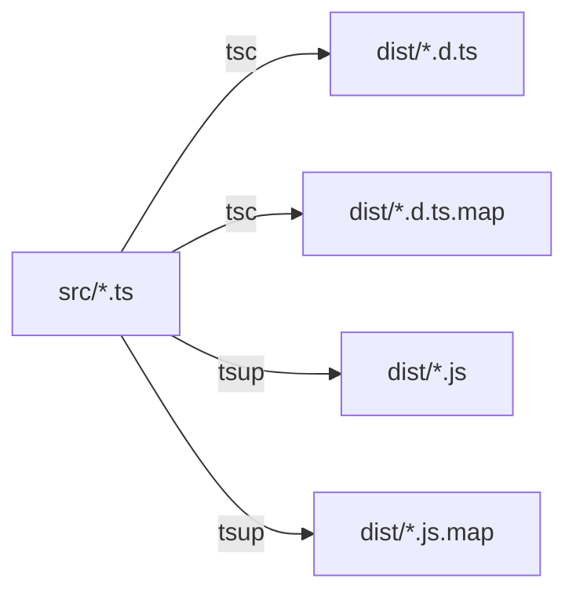
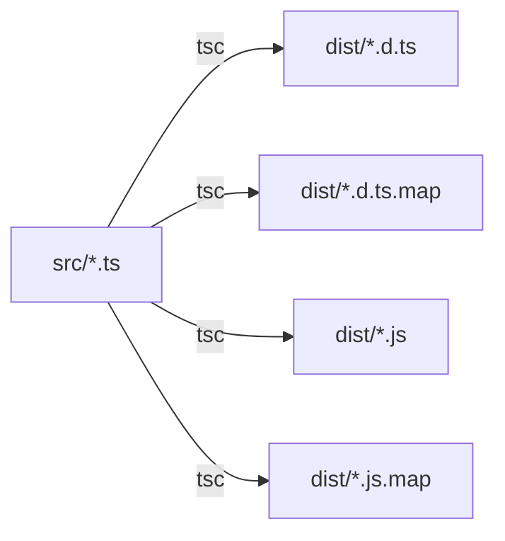
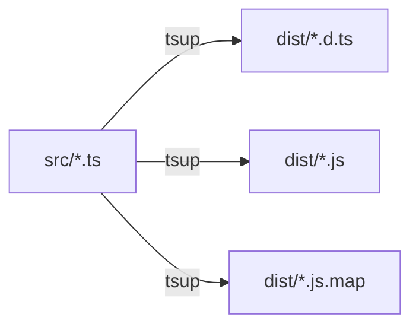

# TypeScript 构建产物详解

## 概览

以 `@dailyuse/contracts` 包为例，构建后生成：

```
dist/
├── index.d.ts          (2KB)    - 主类型声明文件
├── index.d.ts.map      (1.5KB)  - 类型声明 Source Map
├── index.js            (47KB)   - 主 JavaScript 文件
├── index.js.map        (112KB)  - JavaScript Source Map
├── modules/            (239个 .d.ts + 239个 .d.ts.map)
└── ...
```

**统计数据**：
- 总大小：2.5MB
- `.d.ts` 文件：239 个
- `.d.ts.map` 文件：239 个
- `.js` 文件：1 个（entry）
- `.js.map` 文件：1 个

---

## 产物类型详解

### 1. `.d.ts` - TypeScript 类型声明文件

#### 作用
- **类型检查**：让 TypeScript 编译器知道导出的类型
- **IDE 智能提示**：VS Code/WebStorm 的自动补全、参数提示
- **API 文档**：描述函数签名、接口结构

#### 示例

```typescript
// src/index.ts (源码)
export interface Account {
  uuid: string;
  username: string;
  email: string;
}

export function createAccount(data: Account): void {
  // ...
}
```

```typescript
// dist/index.d.ts (生成的类型声明)
export interface Account {
    uuid: string;
    username: string;
    email: string;
}
export declare function createAccount(data: Account): void;
```

#### 生成工具
- **tsc**：`tsc --build` 生成（当前配置）
- 优势：支持 `composite` 项目引用、增量编译

#### 谁需要它？
- ✅ **其他 TypeScript 包**（如 utils, domain-server）
- ✅ **IDE**（VS Code 类型提示）
- ✅ **TypeScript 编译器**（类型检查）
- ❌ **运行时**（JavaScript 引擎不使用）

---

### 2. `.d.ts.map` - 类型声明 Source Map

#### 作用
- **IDE 跳转到源码**：点击 "Go to Definition" 时跳转到 `.ts` 而非 `.d.ts`
- **调试时显示源码**：而非编译后的类型声明

#### 示例

```json
// dist/index.d.ts.map (简化)
{
  "version": 3,
  "file": "index.d.ts",
  "sourceRoot": "",
  "sources": ["../src/index.ts"],
  "mappings": "AAAA;AACA;AACA..."
}
```

#### 生成工具
- **tsc**：`declarationMap: true` 生成

#### 谁需要它？
- ✅ **开发者**（IDE 跳转到源码）
- ✅ **VS Code**（调试时）
- ❌ **生产环境**（可以不发布）

#### 文件大小
- 通常是 `.d.ts` 的 50-100%
- 包含 base64 编码的映射信息

---

### 3. `.js` - JavaScript 运行时文件

#### 作用
- **实际执行**：Node.js/浏览器运行的代码
- **运行时逻辑**：包含所有业务逻辑

#### 示例

```javascript
// dist/index.js (tsup 生成)
export var AccountType;
(function(AccountType2) {
  AccountType2["Personal"] = "PERSONAL";
  AccountType2["Organization"] = "ORGANIZATION";
})(AccountType || (AccountType = {}));

export function createAccount(data) {
  // 实际的运行时代码
  console.log(`Creating account for ${data.username}`);
}
```

#### 生成工具
- **tsup**：基于 esbuild，生成 ESM 格式（当前配置）
- 特点：
  - 🚀 **速度极快**（比 tsc 快 10-100 倍）
  - 📦 **Tree-shaking**：移除未使用的代码
  - 🔀 **Code-splitting**：按需加载

#### 谁需要它？
- ✅ **Node.js**（服务端运行）
- ✅ **浏览器**（客户端运行）
- ✅ **其他 JS 包**（运行时依赖）
- ❌ **TypeScript 编译器**（只需要 .d.ts）

#### 优化

```typescript
// tsup.config.ts
{
  minify: false,      // 库不压缩（让使用者决定）
  splitting: true,    // 启用代码分割
  treeshake: true,    // 移除未使用代码
  target: 'es2020',   // 目标环境
}
```

---

### 4. `.js.map` - JavaScript Source Map

#### 作用
- **调试时显示源码**：浏览器/Node.js 调试时看到 TypeScript 源码
- **错误堆栈追踪**：错误信息指向 `.ts` 文件而非 `.js`

#### 示例

```json
// dist/index.js.map (简化)
{
  "version": 3,
  "sources": ["../src/index.ts", "../src/account.ts"],
  "sourcesContent": ["export interface Account {...}", "..."],
  "mappings": "AAAA,OAAO,KAAK...",
  "names": []
}
```

#### 生成工具
- **tsup**：`sourcemap: true` 生成

#### 谁需要它？
- ✅ **开发者**（调试时）
- ✅ **浏览器 DevTools**（源码映射）
- ✅ **Node.js 调试器**（VS Code Debug）
- ❌ **生产环境**（可选，影响性能监控）

#### 文件大小
- 通常是 `.js` 的 1.5-3 倍
- 包含完整的源码内容（`sourcesContent`）

---

## 构建流程对比

### 当前配置（tsc + tsup）



**特点**：
- ✅ 保留 composite 增量编译
- ✅ IDE 跳转到源码
- ✅ 快速的 JS 生成（tsup）
- ⚠️ 需要协调两个工具

### 纯 tsc 方案



**特点**：
- ✅ 配置简单
- ✅ 完全一致的输出
- ❌ 慢（tsc 生成 JS 很慢）
- ❌ 无 tree-shaking

### 纯 tsup 方案



**特点**：
- ✅ 配置简单
- ✅ 速度快
- ❌ 不支持 composite
- ❌ 无 declarationMap（IDE 跳转到 .d.ts）

---

## 文件大小分析

### 以 contracts 包为例

| 文件类型 | 数量 | 总大小 | 单个平均 | 用途 |
|---------|-----|--------|---------|------|
| `.d.ts` | 239 | ~500KB | 2KB | 类型检查 |
| `.d.ts.map` | 239 | ~400KB | 1.7KB | IDE 跳转 |
| `.js` | 1 | 47KB | 47KB | 运行时 |
| `.js.map` | 1 | 112KB | 112KB | 调试 |
| **总计** | 480 | **2.5MB** | - | - |

### 为什么 .js 文件少但很大？

**原因**：tsup 使用 **code-splitting** 和 **tree-shaking**

```javascript
// 多个源文件被打包成一个 entry
// src/index.ts
export * from './account';
export * from './auth';
export * from './goal';
// ...

// dist/index.js (合并后)
// - 所有 account 相关代码
// - 所有 auth 相关代码
// - 所有 goal 相关代码
// ...
```

### 为什么 .d.ts 文件多但小？

**原因**：tsc 保留原始文件结构

```
src/
  modules/
    account/
      aggregates/
        AccountClient.ts   → dist/modules/account/aggregates/AccountClient.d.ts
        AccountServer.ts   → dist/modules/account/aggregates/AccountServer.d.ts
      entities/
        ...
```

---

## 生产环境发布

### package.json 配置

```json
{
  "main": "dist/index.js",
  "types": "dist/index.d.ts",
  "exports": {
    ".": {
      "types": "./dist/index.d.ts",
      "import": "./dist/index.js"
    }
  },
  "files": [
    "dist"
  ]
}
```

### 哪些文件需要发布？

| 文件类型 | 发布 | 原因 |
|---------|-----|------|
| `.d.ts` | ✅ 必须 | TypeScript 用户需要 |
| `.d.ts.map` | ⚠️ 推荐 | 开发体验更好（IDE 跳转） |
| `.js` | ✅ 必须 | 运行时代码 |
| `.js.map` | ⚠️ 可选 | 生产环境调试（影响性能） |
| `src/` | ❌ 不发布 | 已编译 |
| `tsconfig.tsbuildinfo` | ❌ 不发布 | 本地缓存 |

### 发布体积优化

```bash
# 发布前检查
npm pack --dry-run

# 实际体积
contracts-0.0.1.tgz: 600KB (压缩后)
  ├── dist/index.js: 47KB
  ├── dist/index.d.ts: 2KB
  ├── dist/*.d.ts: 500KB (239个文件)
  └── dist/*.d.ts.map: 400KB (可选)
```

---

## 最佳实践

### 1. 开发环境

```json
{
  "compilerOptions": {
    "declaration": true,         // 生成 .d.ts
    "declarationMap": true,      // 生成 .d.ts.map (IDE 跳转)
    "sourceMap": true,           // 生成 .js.map (调试)
    "emitDeclarationOnly": true  // 只生成类型（JS 由 tsup 生成）
  }
}
```

### 2. CI/CD 构建

```bash
# 清理旧产物
rm -rf dist tsconfig.tsbuildinfo

# 类型生成（tsc）
pnpm typecheck

# JS 生成（tsup）
pnpm build
```

### 3. Git 忽略

```gitignore
# 构建产物
dist/

# 构建缓存
*.tsbuildinfo
tsconfig.tsbuildinfo

# Source maps（可选）
*.js.map
*.d.ts.map
```

---

## FAQ

### Q1: 为什么需要两个工具（tsc + tsup）？

**A**: 各有优势
- **tsc**: 类型声明生成 + composite 支持
- **tsup**: 快速 JS 生成 + tree-shaking

### Q2: .d.ts.map 有什么用？

**A**: IDE "Go to Definition" 跳转到 `.ts` 源码而非 `.d.ts`

### Q3: 生产环境需要 .js.map 吗？

**A**: 可选
- ✅ 优点：错误追踪更准确
- ❌ 缺点：暴露源码、增加体积

### Q4: 为什么 .js.map 这么大？

**A**: 包含完整源码（`sourcesContent`），方便调试

### Q5: 能否只用一个工具？

**A**: 可以，但有取舍
- **纯 tsc**: 慢，无 tree-shaking
- **纯 tsup**: 快，但不支持 composite

---

**总结**：当前配置（tsc + tsup）是最优方案，兼顾了速度、类型安全和开发体验。
