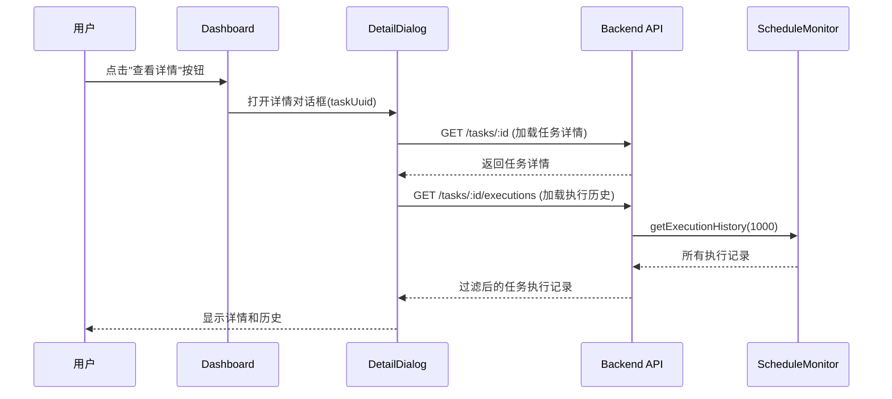

# Schedule 详情页面实现完成报告

## 📋 实现概述

已完成 Schedule Task 详情查看功能的前后端实现，用户可以查看任务的详细信息和执行历史记录。

## ✅ 已完成的工作

### 1. 前端组件

#### 1.1 ScheduleTaskDetailDialog.vue
- **路径**: `apps/web/src/modules/schedule/presentation/components/ScheduleTaskDetailDialog.vue`
- **功能**:
  - 以对话框形式展示任务详情
  - 显示任务基本信息（名称、描述、来源模块、状态）
  - 显示执行信息（执行次数、下次执行时间、上次执行状态）
  - 显示调度配置（Cron 表达式、时区、开始/结束日期）
  - 显示执行历史记录列表
  - 支持刷新执行历史

#### 1.2 更新 Task Card 组件
更新了三个 Task Card 组件，添加"查看详情"按钮：
- `ReminderTasksCard.vue` - 提醒模块任务卡片
- `TaskModuleTasksCard.vue` - 任务模块任务卡片  
- `GoalTasksCard.vue` - 目标模块任务卡片

**修改内容**:
- 添加"查看详情"图标按钮（眼睛图标）
- 添加 `view-detail` 事件到 emit 定义
- 点击按钮触发 `@view-detail` 事件

#### 1.3 更新 ScheduleDashboardView
- **路径**: `apps/web/src/modules/schedule/presentation/views/ScheduleDashboardView.vue`
- **修改**:
  - 导入 `ScheduleTaskDetailDialog` 组件
  - 添加 `detailDialog` 状态管理
  - 实现 `handleViewDetail()` 函数
  - 为三个 Task Card 组件绑定 `@view-detail` 事件

### 2. 后端 API

#### 2.1 ScheduleTaskController
- **路径**: `apps/api/src/modules/schedule/interface/http/controllers/ScheduleTaskController.ts`
- **修改**:
  - 导入 `ScheduleMonitor`
  - 添加 `getScheduleMonitor()` 辅助方法
  - 实现 `getTaskExecutions()` 方法

#### 2.2 新增 API 端点
- **端点**: `GET /api/v1/schedules/tasks/:id/executions`
- **功能**: 获取指定任务的执行历史记录
- **权限**: 需要认证，只能查看自己的任务
- **参数**:
  - `id` (路径参数): 任务 UUID
  - `limit` (查询参数, 可选): 返回记录数量，默认 20

**返回数据格式**:
```typescript
{
  uuid: string,           // 执行记录唯一标识
  executionTime: number,  // 执行时间戳
  status: 'success' | 'failed' | 'running',
  duration: number | null,  // 执行耗时（毫秒）
  errorMessage: string | null  // 错误信息
}[]
```

#### 2.3 路由配置
- **路径**: `apps/api/src/modules/schedule/interface/http/routes/scheduleRoutes.ts`
- **修改**: 添加执行历史路由 `router.get('/tasks/:id/executions', ScheduleTaskController.getTaskExecutions)`

### 3. 数据流



## 🎨 UI 特性

### 详情对话框布局
1. **头部**: 任务名称 + 关闭按钮
2. **左侧 (基本信息卡片)**:
   - 任务名称
   - 描述
   - 来源模块（带颜色标签）
   - 任务状态（带图标和颜色）
   - 启用状态

3. **右侧 (执行信息卡片)**:
   - 执行次数
   - 下次执行时间
   - 上次执行时间
   - 上次执行状态
   - 连续失败次数（如果 > 0）

4. **调度配置卡片**:
   - Cron 表达式
   - 时区
   - 开始/结束日期

5. **执行历史卡片**:
   - 执行时间
   - 状态（成功/失败/运行中）
   - 执行耗时
   - 错误信息（如果失败）
   - 刷新按钮

### 颜色方案
- **来源模块**:
  - Reminder: `primary` (蓝色)
  - Task: `success` (绿色)
  - Goal: `warning` (橙色)

- **任务状态**:
  - Active: `success` (绿色)
  - Paused: `warning` (橙色)
  - Completed: `info` (蓝色)
  - Cancelled: `error` (红色)

- **执行状态**:
  - Success: `success` (绿色)
  - Failed: `error` (红色)
  - Running: `info` (蓝色)

## 🔧 技术实现细节

### 1. 类型安全
- 使用 `ScheduleContracts.ScheduleTaskClientDTO` 类型
- 时间戳支持 `number | string | null | undefined`
- Watch 中添加类型守卫确保 `uuid` 为 `string`

### 2. 错误处理
- 加载状态管理（`isLoading`, `isLoadingHistory`）
- 错误状态显示
- 空状态提示

### 3. 性能优化
- 懒加载对话框内容
- 执行历史分页（limit 参数）
- 后端过滤减少数据传输

### 4. 用户体验
- 加载动画
- 刷新功能
- 格式化的日期时间显示
- 友好的空状态提示
- 响应式布局

## 📝 使用说明

### 用户操作流程
1. 打开 Schedule Dashboard
2. 在任意任务卡片中找到任务
3. 点击任务右侧的"眼睛"图标（查看详情按钮）
4. 查看任务详情和执行历史
5. 点击"刷新"按钮更新执行历史
6. 点击"关闭"或对话框外部关闭详情

### API 调用示例
```bash
# 获取任务详情
GET /api/v1/schedules/tasks/{taskUuid}

# 获取执行历史（默认 20 条）
GET /api/v1/schedules/tasks/{taskUuid}/executions

# 获取执行历史（指定数量）
GET /api/v1/schedules/tasks/{taskUuid}/executions?limit=50
```

## 🔍 已知限制

1. **执行历史存储**: 
   - 当前执行历史存储在内存中（ScheduleMonitor）
   - 应用重启后历史记录会丢失
   - 建议后续持久化到数据库

2. **分页**: 
   - 前端一次性加载所有返回的记录
   - 后端最多返回 1000 条记录并过滤
   - 未实现真正的分页加载

3. **实时更新**: 
   - 执行历史需要手动刷新
   - 未实现 WebSocket 实时推送

## 🚀 后续改进建议

1. **持久化执行历史**:
   - 创建 `ScheduleExecutionRecord` 实体
   - 存储到数据库
   - 支持查询和统计

2. **增强分页**:
   - 实现游标分页
   - 支持无限滚动加载

3. **实时更新**:
   - 使用 WebSocket 推送新的执行记录
   - 自动刷新正在运行的任务状态

4. **详细分析**:
   - 执行时间趋势图表
   - 成功率统计
   - 性能分析

5. **导出功能**:
   - 导出执行历史为 CSV
   - 下载详细执行日志

## ✅ 测试检查清单

- [ ] 打开详情对话框显示正确的任务信息
- [ ] 执行历史正确显示
- [ ] 刷新执行历史功能正常
- [ ] 权限验证（只能查看自己的任务）
- [ ] 错误处理（任务不存在、网络错误等）
- [ ] 响应式布局在不同屏幕尺寸下正常
- [ ] 加载状态和空状态显示正常
- [ ] 日期时间格式化正确
- [ ] 颜色方案符合设计
- [ ] 关闭对话框清理状态

## 📚 相关文档

- [Schedule Module Implementation Complete](./SCHEDULE_MODULE_IMPLEMENTATION_COMPLETE.md)
- [Schedule Cross Module Implementation](./SCHEDULE_CROSS_MODULE_IMPLEMENTATION.md)
- [Schedule Monitoring Implementation](./SCHEDULE_MONITORING_IMPLEMENTATION.md)

---

**实现日期**: 2024-01-XX  
**实现状态**: ✅ 完成（待测试）  
**下一步**: 修复 notification 创建问题，测试执行历史功能
