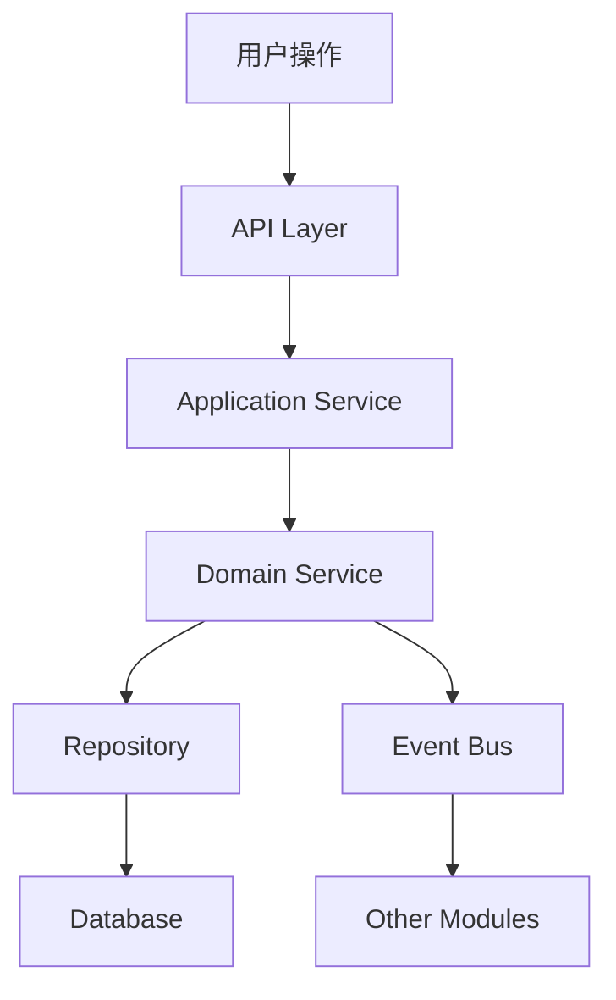

# 业务流程文档 (Business Flows)

> 本目录包含跨模块的业务流程文档，帮助快速理解系统的端到端业务逻辑

## 📋 文档索引

### 提醒业务流程
- [Reminder 提醒服务流程](./reminder-flow.md) - 独立提醒服务的完整业务流程
- [Goal 目标提醒流程](./goal-reminder-flow.md) - 目标截止日期提醒的业务流程
- [Task 任务提醒流程](./task-reminder-flow.md) - 任务提醒的业务流程

### 通知业务流程
- [通知系统流程](./notification-flow.md) - 统一通知系统的业务流程

### 调度业务流程
- [Schedule 调度系统流程](./schedule-flow.md) - 🔥 **后台任务调度的完整运行机制（必读）**

---

## 🎯 业务流程文档的作用

### 1. 快速理解系统
- **端到端视角**：从用户操作到系统响应的完整链路
- **跨模块协作**：理解不同模块如何协同工作
- **数据流转**：追踪数据在各模块间的流动

### 2. 开发指南
- **新功能开发**：了解如何在现有流程中添加新功能
- **问题排查**：快速定位问题发生的环节
- **代码审查**：理解代码修改对整体流程的影响

### 3. 架构决策
- **模块边界**：明确各模块的职责边界
- **依赖关系**：理解模块间的依赖关系
- **扩展点**：识别系统的扩展点和集成点

---

## 📐 业务流程图示例

---

## 🏗️ 系统架构概览

### 核心模块
- **Goal** - 目标管理（OKR）
- **Task** - 任务管理（GTD）
- **Reminder** - 提醒服务
- **Schedule** - 调度系统
- **Notification** - 通知系统

### 基础设施
- **Authentication** - 认证授权
- **Repository** - 知识库
- **Editor** - 编辑器
- **AI** - AI 服务

---

## 📖 阅读指南

### 按角色阅读
- **产品经理**：了解业务逻辑和用户体验
- **开发工程师**：理解技术实现和代码结构
- **测试工程师**：掌握测试场景和验证点
- **运维工程师**：了解系统运行和监控点

### 按需求阅读
- **新功能开发**：先读相关模块的业务流程
- **Bug 修复**：定位问题所在的流程环节
- **性能优化**：找出性能瓶颈的流程节点
- **架构重构**：理解现有流程后再设计新架构

---

## 🔗 相关文档

- [模块文档](../modules/README.md) - 各模块的详细文档
- [架构文档](../architecture/README.md) - 系统架构设计文档
- [API 文档](../reference/api/README.md) - API 接口文档
- [开发指南](../guides/development/README.md) - 开发规范和最佳实践

---

**提示**：业务流程文档会随着系统演进而更新，请定期查看最新版本。
