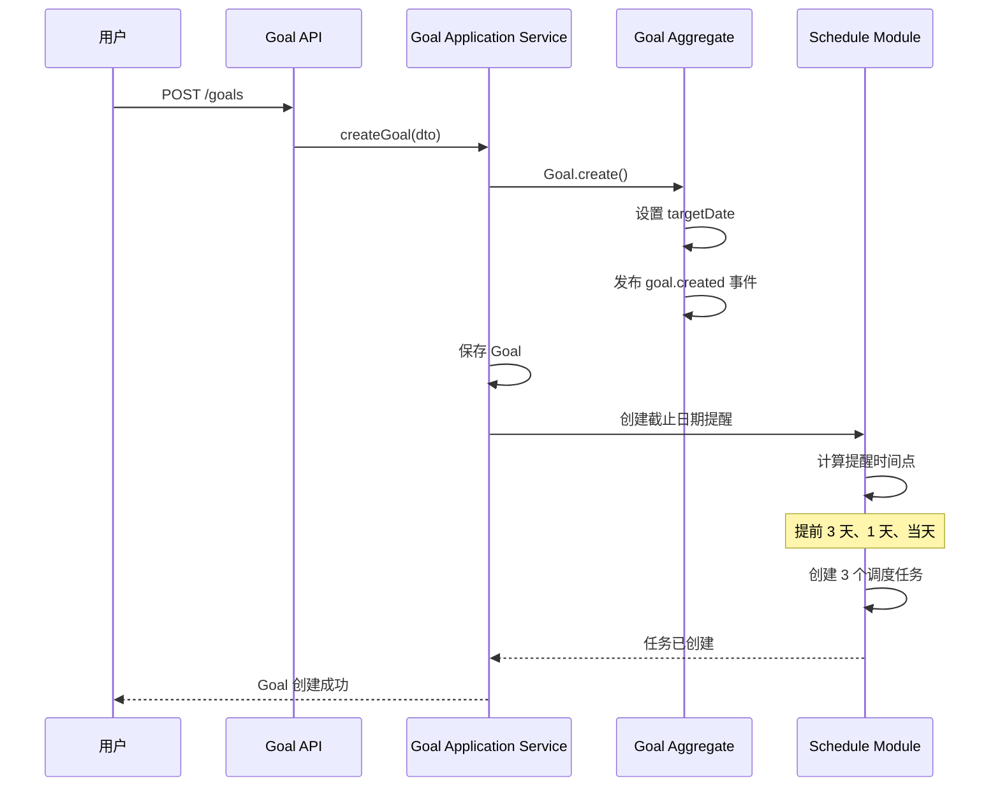
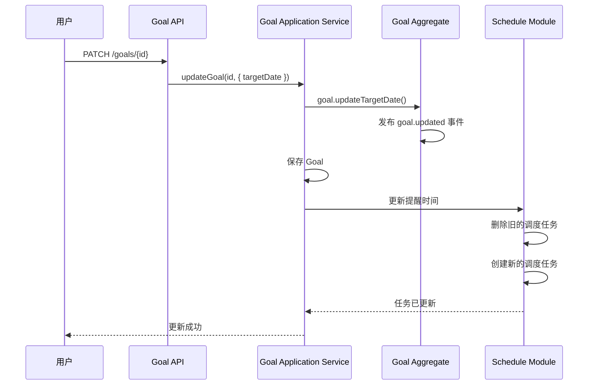
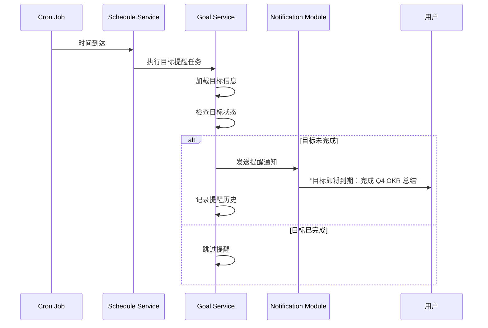

# Goal 目标提醒业务流程

> **核心模块**：Goal + Schedule + Notification  
> **更新日期**：2025-11-26  
> **状态**：✅ 已实施

---

## 📋 目录

- [概述](#概述)
- [业务场景](#业务场景)
- [业务流程](#业务流程)
- [技术实现](#技术实现)
- [与 Reminder 的区别](#与-reminder-的区别)
- [关键代码](#关键代码)

---

## 概述

### 什么是 Goal 提醒？

Goal 提醒是**基于目标截止日期的自动提醒**，当目标即将到期或已逾期时，系统会自动通知用户。

**特点**：
- **自动创建**：用户设置目标截止日期后自动生成
- **生命周期绑定**：随目标创建/更新/删除而变化
- **不可单独管理**：提醒配置与目标配置一体

---

## 业务场景

### 场景 1：目标即将到期

```
📅 目标：完成 Q4 OKR 总结
   截止日期：2025-12-31
   
🔔 提醒时间：
   - 2025-12-28 09:00（提前 3 天）
   - 2025-12-30 09:00（提前 1 天）
   - 2025-12-31 09:00（当天）
```

### 场景 2：目标已逾期

```
📅 目标：学习 DDD 架构
   截止日期：2025-11-20（已过期）
   
🔔 提醒：
   - 2025-11-21 09:00：目标已逾期 1 天
   - 2025-11-22 09:00：目标已逾期 2 天
   （持续提醒，直到目标完成或删除）
```

---

## 业务流程

### 流程 1：创建目标时自动创建提醒



**关键步骤**：
1. **用户创建目标**：设置标题、截止日期等
2. **创建 Goal 聚合根**：包含完整目标信息
3. **发布领域事件**：`goal.created` 事件
4. **自动创建提醒**：Schedule 模块监听事件，创建多个提醒
5. **计算提醒时间**：
   - 提前 3 天：`targetDate - 3天`
   - 提前 1 天：`targetDate - 1天`
   - 当天：`targetDate` 早上 9:00

### 流程 2：更新目标截止日期



**关键步骤**：
1. **用户修改截止日期**
2. **更新 Goal**
3. **发布更新事件**：`goal.updated`
4. **重新创建提醒**：删除旧提醒，创建新提醒

### 流程 3：目标提醒触发



**关键步骤**：
1. **Cron 触发**：到达预定的提醒时间
2. **加载目标**：查询目标详情
3. **状态检查**：如果目标已完成，跳过提醒
4. **发送通知**：通过 Notification 模块发送
5. **记录历史**：记录提醒发送情况

---

## 技术实现

### 架构图

```
┌──────────────────────────────────────────┐
│            Goal Module                   │
│  ┌────────────────────────────────────┐  │
│  │ Goal Aggregate                     │  │
│  │  - uuid                            │  │
│  │  - title                           │  │
│  │  - targetDate (截止日期)           │  │
│  │  - status (ACTIVE/COMPLETED)       │  │
│  └────────┬───────────────────────────┘  │
│           │ 发布事件                      │
│           │ goal.created                 │
│           │ goal.updated                 │
│           │ goal.deleted                 │
└───────────┼──────────────────────────────┘
            │
            ▼
┌──────────────────────────────────────────┐
│         Schedule Module                  │
│  ┌────────────────────────────────────┐  │
│  │ GoalScheduleStrategy               │  │
│  │  - 监听 Goal 事件                   │  │
│  │  - 创建提醒调度任务                 │  │
│  └────────┬───────────────────────────┘  │
│           │                              │
│  ┌────────▼───────────────────────────┐  │
│  │ Cron Jobs                          │  │
│  │  - Goal-{uuid}-3days (提前3天)     │  │
│  │  - Goal-{uuid}-1day (提前1天)      │  │
│  │  - Goal-{uuid}-today (当天)        │  │
│  └────────┬───────────────────────────┘  │
└───────────┼──────────────────────────────┘
            │ 触发
            ▼
┌──────────────────────────────────────────┐
│      Notification Module                 │
│  - 发送应用内通知                         │
│  - 发送浏览器推送                         │
│  - 可选：邮件/短信                        │
└──────────────────────────────────────────┘
```

### 数据结构

#### Goal 表
```sql
goals (
  uuid              VARCHAR PRIMARY KEY,
  account_uuid      VARCHAR,
  title             VARCHAR,
  description       TEXT,
  target_date       TIMESTAMP,  -- 截止日期
  status            VARCHAR,    -- 'ACTIVE' | 'COMPLETED' | 'ARCHIVED'
  importance        VARCHAR,    -- 重要性级别
  created_at        TIMESTAMP,
  updated_at        TIMESTAMP
)
```

#### Schedule Task 表
```sql
schedule_tasks (
  uuid              VARCHAR PRIMARY KEY,
  source_module     VARCHAR,  -- 'GOAL'
  source_entity_id  VARCHAR,  -- Goal UUID
  name              VARCHAR,  -- 'Goal Deadline Reminder: 完成 Q4 OKR'
  schedule_config   TEXT,     -- Cron 配置 JSON
  enabled           BOOLEAN,
  metadata          TEXT,     -- 包含提醒类型（3天前/1天前/当天）
  created_at        TIMESTAMP
)
```

---

## 与 Reminder 的区别

| 维度 | Goal 提醒 | Reminder 提醒 |
|------|-----------|---------------|
| **触发源** | 目标截止日期（自动） | 用户主动创建 |
| **生命周期** | 随目标创建/删除 | 独立管理 |
| **灵活性** | 固定规则（提前 3天/1天/当天） | 完全自定义 |
| **重复性** | 不重复（一次性） | 支持循环 |
| **管理方式** | 不可单独修改 | 可暂停/恢复/删除 |
| **使用场景** | 目标到期提醒 | 日常提醒（吃药、喝水等） |

---

## 关键代码

### 1. 监听 Goal 事件创建提醒

```typescript
// apps/api/src/modules/goal/application/listeners/GoalEventListener.ts

@Injectable()
export class GoalEventListener {
  @OnEvent('goal.created')
  async handleGoalCreated(event: GoalCreatedEvent) {
    const goal = event.payload.goal;
    
    // 如果有截止日期，创建提醒
    if (goal.targetDate) {
      await this.scheduleService.createDeadlineReminders({
        sourceModule: SourceModule.GOAL,
        sourceEntityId: goal.uuid,
        targetDate: goal.targetDate,
        title: goal.title,
        accountUuid: goal.accountUuid,
      });
    }
  }
  
  @OnEvent('goal.updated')
  async handleGoalUpdated(event: GoalUpdatedEvent) {
    // 如果截止日期变化，重新创建提醒
    if (event.payload.changes.includes('targetDate')) {
      await this.scheduleService.recreateDeadlineReminders(
        event.payload.goal.uuid
      );
    }
  }
  
  @OnEvent('goal.deleted')
  async handleGoalDeleted(event: GoalDeletedEvent) {
    // 删除所有相关的提醒
    await this.scheduleService.deleteAllTasksBySource(
      SourceModule.GOAL,
      event.payload.goalUuid
    );
  }
}
```

### 2. 创建截止日期提醒

```typescript
// packages/domain-server/src/schedule/services/ScheduleService.ts

async createDeadlineReminders(params: {
  sourceModule: SourceModule;
  sourceEntityId: string;
  targetDate: number;
  title: string;
  accountUuid: string;
}): Promise<void> {
  const { targetDate, title } = params;
  
  // 创建 3 个提醒：提前 3 天、1 天、当天
  const reminderConfigs = [
    { offset: 3 * 24 * 60 * 60 * 1000, label: '提前 3 天' },
    { offset: 1 * 24 * 60 * 60 * 1000, label: '提前 1 天' },
    { offset: 0, label: '当天' },
  ];
  
  for (const config of reminderConfigs) {
    const reminderTime = targetDate - config.offset;
    
    // 只创建未来的提醒
    if (reminderTime > Date.now()) {
      await this.createScheduleTask({
        ...params,
        name: `Goal Deadline Reminder: ${title} (${config.label})`,
        scheduleConfig: {
          cronExpression: this.timestampToCron(reminderTime),
          timezone: 'Asia/Shanghai',
          startDate: reminderTime,
          endDate: null,
          maxExecutions: 1, // 只执行一次
        },
        metadata: {
          reminderType: 'GOAL_DEADLINE',
          offset: config.offset,
          label: config.label,
        },
      });
    }
  }
}
```

### 3. 执行目标提醒任务

```typescript
// packages/domain-server/src/schedule/executors/GoalDeadlineExecutor.ts

async execute(payload: GoalDeadlinePayload): Promise<void> {
  // 1. 加载目标
  const goal = await this.goalRepository.findByUuid(payload.goalUuid);
  
  // 2. 检查状态
  if (goal.status === 'COMPLETED') {
    return; // 已完成的目标不再提醒
  }
  
  // 3. 计算距离截止日期的天数
  const daysLeft = Math.ceil(
    (goal.targetDate - Date.now()) / (24 * 60 * 60 * 1000)
  );
  
  // 4. 构造通知内容
  let message: string;
  if (daysLeft > 0) {
    message = `目标"${goal.title}"还有 ${daysLeft} 天到期`;
  } else if (daysLeft === 0) {
    message = `目标"${goal.title}"今天到期`;
  } else {
    message = `目标"${goal.title}"已逾期 ${-daysLeft} 天`;
  }
  
  // 5. 发送通知
  await this.notificationService.send({
    accountUuid: goal.accountUuid,
    title: '目标截止日期提醒',
    body: message,
    channels: ['IN_APP', 'PUSH'],
    sourceModule: SourceModule.GOAL,
    sourceEntityId: goal.uuid,
  });
}
```

---

## 测试场景

### 场景 1：创建目标自动创建提醒

```typescript
describe('Goal 提醒自动创建', () => {
  it('创建目标时应该自动创建 3 个提醒', async () => {
    const goal = await goalService.createGoal({
      title: '完成 Q4 OKR',
      targetDate: Date.now() + 7 * 24 * 60 * 60 * 1000, // 7天后
    });
    
    // 验证创建了 3 个调度任务
    const tasks = await scheduleService.findTasksBySource(
      SourceModule.GOAL,
      goal.uuid
    );
    
    expect(tasks).toHaveLength(3);
    expect(tasks[0].metadata.label).toBe('提前 3 天');
    expect(tasks[1].metadata.label).toBe('提前 1 天');
    expect(tasks[2].metadata.label).toBe('当天');
  });
});
```

### 场景 2：更新截止日期更新提醒

```typescript
describe('更新截止日期', () => {
  it('修改截止日期应该重新创建提醒', async () => {
    const goal = await goalService.createGoal({
      title: '学习 DDD',
      targetDate: Date.now() + 7 * 24 * 60 * 60 * 1000,
    });
    
    const oldTasks = await scheduleService.findTasksBySource(
      SourceModule.GOAL,
      goal.uuid
    );
    
    // 修改截止日期
    await goalService.updateGoal(goal.uuid, {
      targetDate: Date.now() + 14 * 24 * 60 * 60 * 1000, // 改为 14 天后
    });
    
    const newTasks = await scheduleService.findTasksBySource(
      SourceModule.GOAL,
      goal.uuid
    );
    
    // 验证任务被重新创建
    expect(newTasks[0].uuid).not.toBe(oldTasks[0].uuid);
    expect(newTasks[0].scheduleConfig.startDate).toBeGreaterThan(
      oldTasks[0].scheduleConfig.startDate
    );
  });
});
```

### 场景 3：完成目标不再提醒

```typescript
describe('完成目标', () => {
  it('完成后不应该再发送提醒', async () => {
    const goal = await goalService.createGoal({
      title: '测试目标',
      targetDate: Date.now() + 1000, // 1 秒后触发
    });
    
    // 标记为完成
    await goalService.completeGoal(goal.uuid);
    
    // 等待触发时间
    await sleep(2000);
    
    // 验证没有发送通知
    const notifications = await notificationService.findBySource(
      SourceModule.GOAL,
      goal.uuid
    );
    expect(notifications).toHaveLength(0);
  });
});
```

---

## 常见问题

### Q1: 为什么 Goal 提醒不能单独管理？

**设计理念**：Goal 提醒是目标的**附属功能**，不是独立实体。
- 提醒的生命周期完全由目标控制
- 避免数据不一致（目标已删除但提醒还在）
- 简化用户操作（不需要单独管理提醒）

### Q2: 如何自定义提醒时间？

当前固定为提前 3 天、1 天、当天。如需自定义，可以：
1. 在 Goal 中添加 `reminderSettings` 字段
2. 用户可配置提醒时间点
3. Schedule 模块根据配置创建提醒

### Q3: 目标逾期后会一直提醒吗？

是的，直到目标**完成**或**删除**，否则会持续提醒。这是设计意图：
- 逾期目标需要引起重视
- 督促用户处理（完成或删除）

---

## 扩展阅读

- [Reminder 提醒服务流程](./reminder-flow.md)
- [Task 任务提醒流程](./task-reminder-flow.md)
- [Schedule 调度系统](./schedule-flow.md)
- [Goal 模块文档](../modules/goal/README.md)
