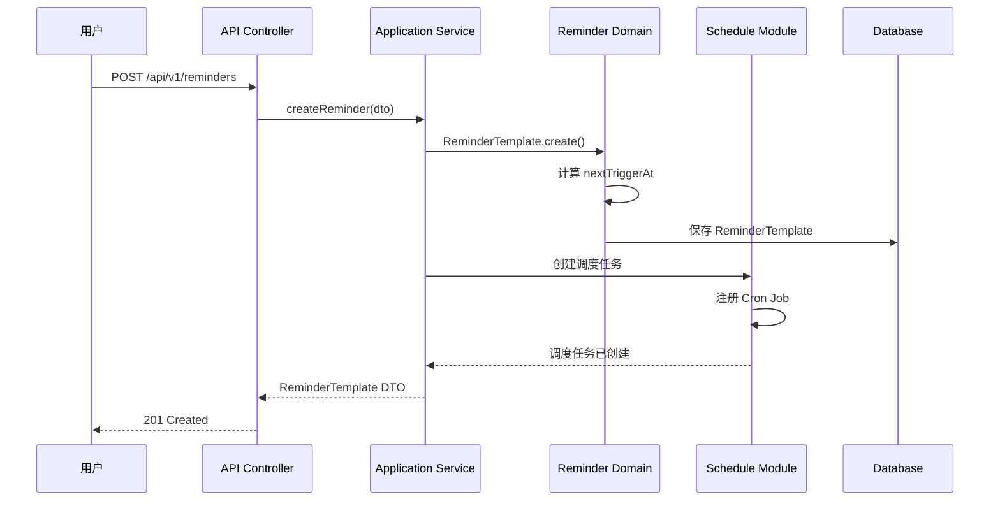
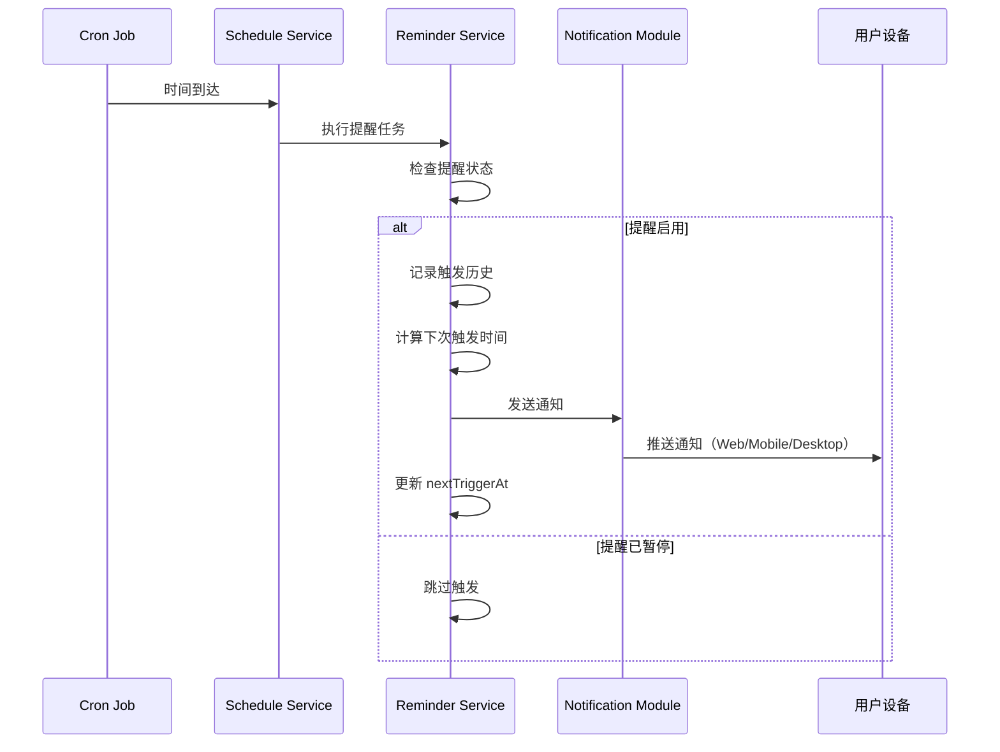
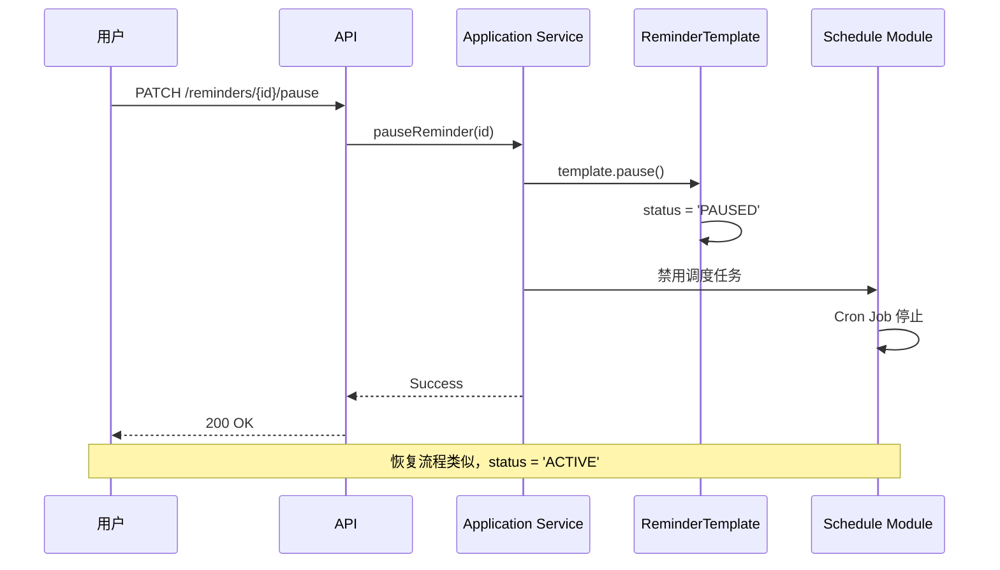
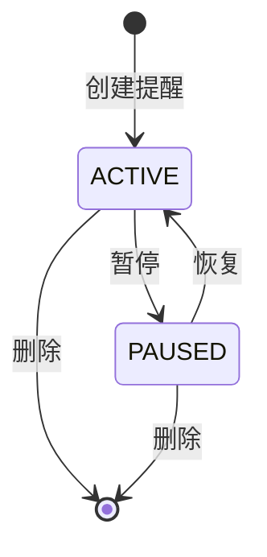

# Reminder 提醒服务业务流程

> **核心模块**：Reminder + Schedule + Notification  
> **更新日期**：2025-11-26  
> **状态**：✅ 已实施

---

## 📋 目录

- [概述](#概述)
- [核心概念](#核心概念)
- [业务流程](#业务流程)
- [技术架构](#技术架构)
- [数据流转](#数据流转)
- [关键代码](#关键代码)
- [测试场景](#测试场景)

---

## 概述

### 什么是 Reminder 提醒服务？

Reminder 是 DailyUse 的**独立提醒服务模块**，允许用户创建各种类型的提醒：
- **一次性提醒**：在指定时间提醒一次
- **循环提醒**：按固定规则重复提醒（每日/每周/自定义）
- **间隔提醒**：每隔 N 分钟提醒一次

### 与其他提醒的区别

| 提醒类型 | 触发源 | 灵活性 | 使用场景 |
|---------|--------|--------|---------|
| **Reminder 提醒** | 用户主动创建 | ⭐⭐⭐⭐⭐ | 吃药提醒、喝水提醒、站会提醒 |
| **Goal 提醒** | 目标截止日期 | ⭐⭐ | 目标到期前 3 天提醒 |
| **Task 提醒** | 任务截止时间 | ⭐⭐⭐ | 任务即将到期提醒 |

---

## 核心概念

### 1. 提醒模板 (ReminderTemplate)

**聚合根**，包含提醒的完整配置：

```typescript
interface ReminderTemplate {
  uuid: string;
  accountUuid: string;
  title: string;
  type: 'ONE_TIME' | 'RECURRING';
  
  // 触发配置
  trigger: TriggerConfig;           // 如何触发
  recurrence?: RecurrenceConfig;    // 如何重复
  
  // 生效控制
  status: 'ACTIVE' | 'PAUSED';      // 启用/暂停
  activeTime: {
    activatedAt: number;             // 激活时间（重构后）
  };
  
  // 通知配置
  notificationConfig: NotificationConfig;
}
```

### 2. 触发器 (Trigger)

定义**如何触发**提醒：

```typescript
type TriggerConfig = 
  | { type: 'FIXED_TIME'; fixedTime: { time: '09:30' } }  // 固定时间
  | { type: 'INTERVAL'; interval: { minutes: 30 } };      // 间隔触发
```

### 3. 重复规则 (Recurrence)

定义**如何重复**（仅 RECURRING 类型）：

```typescript
type RecurrenceConfig = 
  | { type: 'DAILY'; daily: { interval: 1 } }                    // 每天
  | { type: 'WEEKLY'; weekly: { weekDays: ['MONDAY', 'FRIDAY'] } } // 每周几
  | { type: 'CUSTOM_DAYS'; customDays: { dates: [timestamp] } }    // 自定义日期
```

---

## 业务流程

### 流程 1：创建提醒



**关键步骤**：
1. **用户提交**：提交提醒配置（标题、触发时间、重复规则）
2. **创建模板**：创建 `ReminderTemplate` 聚合根
3. **计算触发时间**：根据 trigger + recurrence 计算 `nextTriggerAt`
4. **创建调度任务**：在 Schedule 模块注册 Cron 任务
5. **返回结果**：返回创建成功的提醒模板

### 流程 2：触发提醒



**关键步骤**：
1. **Cron 触发**：Schedule 模块的 Cron Job 到达触发时间
2. **执行任务**：调用 Reminder 的执行器 (Executor)
3. **状态检查**：检查提醒是否启用 (`status === 'ACTIVE'`)
4. **记录历史**：创建 `ReminderHistory` 记录触发详情
5. **发送通知**：通过 Notification 模块发送通知
6. **更新时间**：计算并更新 `nextTriggerAt`

### 流程 3：暂停/恢复提醒



**关键步骤**：
1. **暂停提醒**：设置 `status = 'PAUSED'`
2. **停止调度**：Schedule 模块停止 Cron Job（但不删除）
3. **恢复提醒**：设置 `status = 'ACTIVE'`，重启 Cron Job

---

## 技术架构

### 模块依赖关系

```
┌─────────────────────────────────────────┐
│         Frontend (Vue 3)                │
│  - ReminderList.vue                     │
│  - ReminderForm.vue                     │
│  - reminderStore (Pinia)                │
└────────────┬────────────────────────────┘
             │ HTTP API
             ▼
┌─────────────────────────────────────────┐
│         API Layer (NestJS)              │
│  - ReminderController                   │
└────────────┬────────────────────────────┘
             │
             ▼
┌─────────────────────────────────────────┐
│      Application Service                │
│  - ReminderApplicationService           │
│  - ReminderQueryApplicationService      │
└────────────┬────────────────────────────┘
             │
             ▼
┌─────────────────────────────────────────┐
│         Domain Layer                    │
│  - ReminderTemplate (Aggregate)         │
│  - ReminderHistory (Entity)             │
│  - TriggerConfig (Value Object)         │
│  - RecurrenceConfig (Value Object)      │
└─────┬───────────────────────────────┬───┘
      │                               │
      │                               │
      ▼                               ▼
┌─────────────────┐          ┌──────────────────┐
│ Schedule Module │          │ Notification     │
│  - Cron Jobs    │          │  - Push/In-App   │
│  - Task Queue   │          │  - Email/SMS     │
└─────────────────┘          └──────────────────┘
```

### 关键组件

#### 1. Domain Layer

**聚合根**：`ReminderTemplate`
- 管理提醒的完整生命周期
- 计算下次触发时间
- 记录触发历史

**领域服务**：`UpcomingReminderCalculationService`
- 计算即将到来的提醒列表
- 计算今日提醒时间表
- 纯函数式设计，无状态

#### 2. Schedule Module

**调度策略**：`ReminderScheduleStrategy`
- 将 Reminder 配置转换为 Cron 表达式
- 处理 FIXED_TIME 和 INTERVAL 两种触发器
- 支持 DAILY、WEEKLY、CUSTOM_DAYS 重复规则

**运行机制**（内存常驻 + 数据库持久化）：

```
┌─────────────────────────────────────────────┐
│ 1. 服务启动时（ScheduleBootstrap）           │
│    - 从数据库加载所有 enabled=true 的任务     │
│    - 注册到 CronJobManager（node-cron）      │
│    - 任务在内存中常驻运行                     │
└────────────┬────────────────────────────────┘
             │
             ▼
┌─────────────────────────────────────────────┐
│ 2. Cron 任务运行（内存中）                    │
│    - node-cron 按 cron 表达式触发            │
│    - 调用 ScheduleTaskExecutor               │
│    - 执行 Reminder 逻辑                      │
└────────────┬────────────────────────────────┘
             │
             ▼
┌─────────────────────────────────────────────┐
│ 3. 执行结果持久化                            │
│    - 更新 nextRunAt、executionCount          │
│    - 记录 ScheduleExecution 历史             │
│    - 保存到数据库                            │
└─────────────────────────────────────────────┘
```

**Cron 表达式示例**：
```typescript
// 每天 09:30
'0 30 9 * * *'

// 每周一、周五 14:00
'0 0 14 * * 1,5'

// 每 30 分钟
'0 0,30 * * * *'
```

**重要说明**：
- ✅ **不是定期扫描**：使用 node-cron 的事件驱动机制，精确到秒
- ✅ **内存常驻**：任务在内存中持续运行，不需要数据库轮询
- ✅ **热重载**：创建/更新/删除 Reminder 时自动同步到 CronJobManager
- ⚠️ **服务重启**：重启后会重新加载所有 enabled 任务
- ⚠️ **数据库同步**：确保 scheduleTask 表中有对应记录且 enabled=true

#### 3. Notification Module

**通知渠道**：
- `IN_APP` - 应用内通知
- `PUSH` - 浏览器推送
- `EMAIL` - 邮件通知
- `SMS` - 短信通知（可选）

---

## 数据流转

### 数据表结构

```sql
-- 提醒模板表
reminder_templates (
  uuid              VARCHAR PRIMARY KEY,
  account_uuid      VARCHAR,
  title             VARCHAR,
  type              VARCHAR,  -- 'ONE_TIME' | 'RECURRING'
  status            VARCHAR,  -- 'ACTIVE' | 'PAUSED'
  
  -- JSON 配置字段
  trigger           TEXT,     -- TriggerConfig JSON
  recurrence        TEXT,     -- RecurrenceConfig JSON
  active_time       TEXT,     -- { activatedAt: number } JSON
  notification_config TEXT,   -- NotificationConfig JSON
  
  -- 触发时间
  next_trigger_at   TIMESTAMP,
  
  -- 时间戳
  created_at        TIMESTAMP,
  updated_at        TIMESTAMP
)

-- 提醒历史表
reminder_history (
  uuid              VARCHAR PRIMARY KEY,
  template_uuid     VARCHAR REFERENCES reminder_templates,
  triggered_at      TIMESTAMP,
  result            VARCHAR,  -- 'SUCCESS' | 'FAILED' | 'SKIPPED'
  error             TEXT,
  created_at        TIMESTAMP
)
```

### 状态机



---

## 关键代码

### 1. 创建提醒（Application Service）

```typescript
// apps/api/src/modules/reminder/application/services/ReminderApplicationService.ts

async createReminder(request: CreateReminderRequest): Promise<ReminderTemplate> {
  // 1. 创建领域对象
  const template = ReminderTemplate.create({
    accountUuid: request.accountUuid,
    title: request.title,
    type: request.type,
    trigger: request.trigger,
    recurrence: request.recurrence,
    activeTime: { activatedAt: Date.now() },
    notificationConfig: request.notificationConfig,
  });
  
  // 2. 持久化
  await this.reminderRepository.save(template);
  
  // 3. 创建调度任务
  await this.scheduleService.createScheduleForReminder(template);
  
  return template;
}
```

### 2. 计算下次触发时间（Domain Service）

```typescript
// packages/domain-server/src/reminder/services/UpcomingReminderCalculationService.ts

static calculateNextTriggerTime(
  reminder: ReminderTemplateServerDTO,
  afterTime: number = Date.now()
): number | null {
  // 检查启用状态
  if (!reminder.selfEnabled || reminder.status !== 'ACTIVE') {
    return null;
  }
  
  // 根据类型计算
  if (reminder.type === 'RECURRING') {
    if (trigger.type === 'FIXED_TIME') {
      return this.calculateNextFixedTimeTrigger(reminder, trigger.fixedTime, afterTime);
    } else if (trigger.type === 'INTERVAL') {
      return this.calculateNextIntervalTrigger(reminder, trigger.interval, afterTime);
    }
  }
  
  return null;
}
```

### 3. 执行提醒任务（Executor）

```typescript
// packages/domain-server/src/schedule/executors/ReminderExecutor.ts

async execute(payload: ReminderExecutorPayload): Promise<void> {
  // 1. 加载提醒模板
  const template = await this.reminderRepository.findByUuid(payload.reminderUuid);
  
  // 2. 检查状态
  if (template.status !== 'ACTIVE') {
    return; // 跳过已暂停的提醒
  }
  
  // 3. 记录触发历史
  template.recordTrigger();
  
  // 4. 发送通知
  await this.notificationService.send({
    accountUuid: template.accountUuid,
    title: template.notificationConfig.title,
    body: template.notificationConfig.body,
    channels: template.notificationConfig.channels,
  });
  
  // 5. 更新下次触发时间
  const nextTriggerAt = this.calculationService.calculateNextTriggerTime(template);
  template.updateNextTriggerAt(nextTriggerAt);
  
  // 6. 保存
  await this.reminderRepository.save(template);
}
```

---

## 测试场景

### 功能测试

#### 场景 1：创建每日提醒
```typescript
describe('创建每日提醒', () => {
  it('应该在每天 09:30 触发', async () => {
    const reminder = await reminderService.createReminder({
      title: '早会提醒',
      type: 'RECURRING',
      trigger: { type: 'FIXED_TIME', fixedTime: { time: '09:30' } },
      recurrence: { type: 'DAILY', daily: { interval: 1 } },
    });
    
    expect(reminder.nextTriggerAt).toBeTomorrow0930();
  });
});
```

#### 场景 2：暂停提醒
```typescript
describe('暂停提醒', () => {
  it('暂停后不应该触发', async () => {
    await reminderService.pauseReminder(reminderId);
    
    const template = await reminderRepository.findByUuid(reminderId);
    expect(template.status).toBe('PAUSED');
    
    // 验证 Cron Job 已停止
    const job = await scheduleService.getJob(reminderId);
    expect(job.enabled).toBe(false);
  });
});
```

#### 场景 3：间隔提醒
```typescript
describe('间隔提醒', () => {
  it('应该每 30 分钟触发一次', async () => {
    const reminder = await reminderService.createReminder({
      title: '喝水提醒',
      type: 'RECURRING',
      trigger: { type: 'INTERVAL', interval: { minutes: 30 } },
    });
    
    // 验证今天的所有触发时间
    const schedule = calculationService.calculateTodaySchedule([reminder]);
    expect(schedule.length).toBeGreaterThan(20); // 一天至少 20 次
  });
});
```

### 集成测试

#### 端到端流程
```typescript
describe('Reminder 端到端流程', () => {
  it('完整流程：创建 -> 触发 -> 通知 -> 更新', async () => {
    // 1. 创建提醒
    const reminder = await api.post('/reminders', {
      title: '测试提醒',
      type: 'RECURRING',
      trigger: { type: 'INTERVAL', interval: { minutes: 1 } },
    });
    
    // 2. 等待触发（1分钟）
    await sleep(60000);
    
    // 3. 验证历史记录
    const history = await api.get(`/reminders/${reminder.uuid}/history`);
    expect(history.length).toBe(1);
    expect(history[0].result).toBe('SUCCESS');
    
    // 4. 验证通知已发送
    const notifications = await api.get('/notifications');
    expect(notifications.some(n => n.source === reminder.uuid)).toBe(true);
    
    // 5. 验证 nextTriggerAt 已更新
    const updated = await api.get(`/reminders/${reminder.uuid}`);
    expect(updated.nextTriggerAt).toBeGreaterThan(Date.now());
  });
});
```

---

## 常见问题

### Q1: 提醒不触发怎么办？

**症状**：创建了提醒，但到了时间却没有触发

**排查步骤**：

#### 1. 检查 Reminder 本身
```sql
-- 检查 ReminderTemplate 状态
SELECT uuid, title, status, next_trigger_at, self_enabled
FROM reminder_templates
WHERE account_uuid = 'xxx';

-- status 应该是 'ACTIVE'
-- self_enabled 应该是 true
-- next_trigger_at 应该是未来时间
```

#### 2. 检查 ScheduleTask 是否存在
```sql
-- 检查是否创建了对应的调度任务
SELECT uuid, name, enabled, status, next_run_at, cron_expression
FROM schedule_tasks
WHERE source_module = 'REMINDER' 
  AND source_entity_id = '<reminder_uuid>';

-- enabled 应该是 true
-- status 应该是 'active'
-- next_run_at 应该和 reminder.next_trigger_at 一致
```

**如果 ScheduleTask 不存在**：
- 问题：创建 Reminder 时没有同步创建 ScheduleTask
- 解决：检查事件监听器或手动调用 `scheduleService.createScheduleForReminder()`

#### 3. 检查 CronJobManager 内存状态
```bash
# 查看日志中的监控报告
2025-11-26T07:30:02.130Z [INFO] [CronJobManager] 📋 CronJobManager 监控报告
  Metadata: { '已注册任务总数': 0, '运行中任务': 0 }
```

**如果 "已注册任务总数" 为 0**：
- 问题：ScheduleBootstrap 启动时没有加载任务
- 原因：数据库中没有 `enabled=true` 的 ScheduleTask
- 解决：
  1. 确保数据库中有记录
  2. 重启 API 服务（会重新加载所有 enabled 任务）
  3. 或手动调用 `ScheduleBootstrap.reload()`

#### 4. 检查 Cron 表达式
```typescript
// 验证 cron 表达式是否正确
import cron from 'node-cron';

cron.validate('0 30 9 * * *'); // 应该返回 true
```

#### 5. 查看执行历史
```sql
-- 检查是否有执行记录
SELECT * FROM schedule_executions
WHERE task_uuid = '<schedule_task_uuid>'
ORDER BY created_at DESC
LIMIT 10;

-- 检查提醒历史
SELECT * FROM reminder_history
WHERE template_uuid = '<reminder_uuid>'
ORDER BY created_at DESC;
```

**常见错误码**：
- `TASK_NOT_FOUND`：ScheduleTask 被删除了
- `REMINDER_PAUSED`：Reminder 被暂停了
- `CRON_EXPRESSION_INVALID`：Cron 表达式格式错误

### Q2: 为什么 CronJobManager 显示 0 个任务？

**症状**：
```bash
[CronJobManager] 监控报告
  '已注册任务总数': 0
  '运行中任务': 0
```

**原因分析**：

#### 原因 1：数据库中没有 ScheduleTask
```sql
-- 检查数据库
SELECT COUNT(*) FROM schedule_tasks WHERE enabled = true;
-- 如果返回 0，说明没有任务
```

**解决方案**：
1. 创建一个 Reminder（会自动创建 ScheduleTask）
2. 或检查之前创建的 Reminder 为什么没有创建 ScheduleTask

#### 原因 2：ScheduleTask 的 enabled 为 false
```sql
-- 检查 enabled 状态
SELECT uuid, name, enabled, status 
FROM schedule_tasks;
```

**解决方案**：
```sql
-- 手动启用
UPDATE schedule_tasks 
SET enabled = true, status = 'active'
WHERE source_module = 'REMINDER';
```

然后重启 API 服务或调用 `ScheduleBootstrap.reload()`。

#### 原因 3：服务启动后创建的任务没有热加载
**场景**：服务启动时数据库是空的，启动后创建了 Reminder

**解决方案**：
- ✅ 正常流程：创建 Reminder 时应该自动调用 `cronManager.registerTask()`
- ⚠️ 如果没有自动注册，检查事件监听器是否正常工作

#### 原因 4：ScheduleBootstrap 没有初始化
**检查日志**：
```bash
# 应该看到这行日志
🚀 开始初始化 Schedule 模块...
📋 查询到活跃任务 count: X
✅ Schedule 模块初始化完成
```

**如果没有看到**：
- 检查 `main.ts` 中是否调用了 `ScheduleBootstrap.getInstance().initialize()`
- 检查是否有错误日志

#### 原因 5：Cron 表达式无效
**检查日志中是否有**：
```bash
❌ 无效的 cron 表达式
  taskUuid: xxx
  cronExpression: 'invalid-cron'
```

**解决方案**：修复 cron 表达式格式

### Q3: 如何修改提醒时间？

```typescript
await reminderService.updateReminder(reminderId, {
  trigger: {
    type: 'FIXED_TIME',
    fixedTime: { time: '10:00' }, // 改为 10:00
  },
});
```

**注意**：修改后会自动重新计算 `nextTriggerAt` 并更新调度任务。

### Q4: 服务重启后提醒还会继续工作吗？

**答案**：✅ **会的**，但需要确保数据正确。

**工作原理**：

```
服务启动
    │
    ▼
ScheduleBootstrap.initialize()
    │
    ▼
从数据库加载所有 enabled=true 的 ScheduleTask
    │
    ▼
注册到 CronJobManager（内存中）
    │
    ▼
Cron 任务开始运行
```

**关键点**：
1. **数据持久化**：ScheduleTask 保存在数据库中，包含 cron 表达式和 nextRunAt
2. **自动恢复**：服务重启时会重新加载所有 enabled 任务
3. **时间同步**：nextRunAt 字段确保不会遗漏任何触发

**注意事项**：
- ⚠️ 如果服务停机时间过长，可能会错过一些触发
- ✅ 间隔提醒（INTERVAL）会自动计算下次触发时间
- ✅ 固定时间提醒（FIXED_TIME）会在下一个时间点触发

### Q5: 如何手动触发一个提醒（测试用）？

**方法 1：修改 nextRunAt 为当前时间**
```sql
-- 将 nextRunAt 改为当前时间
UPDATE schedule_tasks
SET next_run_at = NOW()
WHERE source_entity_id = '<reminder_uuid>';
```

**方法 2：调用 API 手动执行**
```bash
# 直接执行 ScheduleTask
POST /api/v1/schedule/tasks/{taskUuid}/execute
```

**方法 3：使用测试脚本**
```typescript
const executor = ScheduleTaskExecutor.getInstance();
await executor.executeTaskByUuid(taskUuid);
```

**方法 4：修改 Cron 为每分钟触发**
```sql
UPDATE schedule_tasks
SET cron_expression = '* * * * *'  -- 每分钟
WHERE uuid = '<task_uuid>';
```

然后重启服务或调用 `ScheduleBootstrap.reload()`。

### Q6: 提醒的 `activatedAt` 字段是什么？

**重构前**：`{ startDate, endDate }` - 有开始和结束时间  
**重构后**：`{ activatedAt }` - 只有激活时间

**原因**：
- `endDate` 与 `status` 形成双重控制，逻辑混乱
- 现在统一由 `status` 字段控制生效
- `activatedAt` 仅作为循环提醒的计算基准

---

## 扩展阅读

- [Reminder 模块文档](../modules/reminder/README.md)
- [Schedule 模块文档](../modules/schedule/README.md)
- [Notification 模块文档](../modules/notification/README.md)
- [Goal 提醒流程](./goal-reminder-flow.md)
- [Task 提醒流程](./task-reminder-flow.md)
