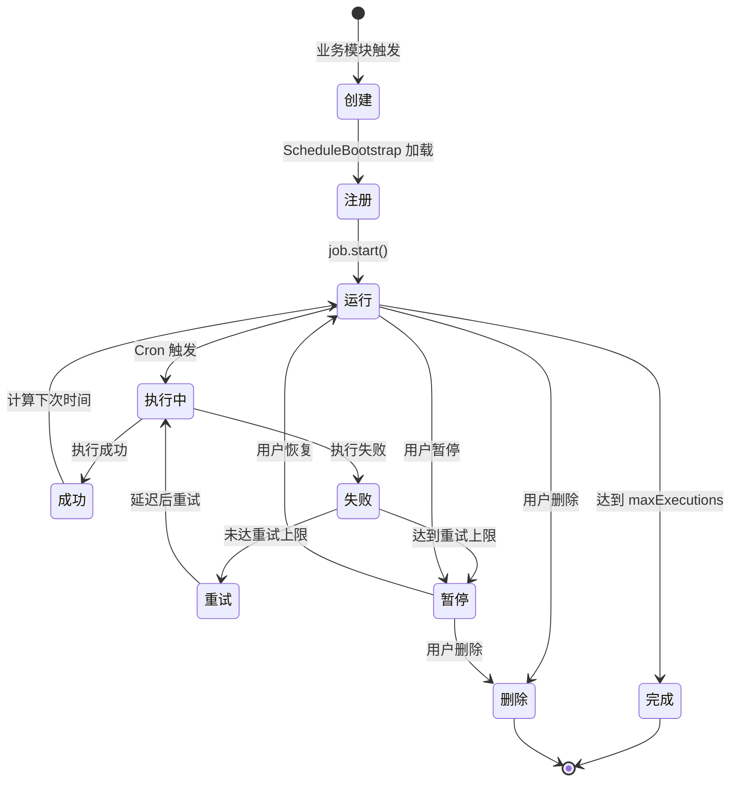

# Schedule 调度系统业务流程

> **核心模块**：Schedule (调度引擎)  
> **更新日期**：2025-11-26  
> **状态**：✅ 已实施

---

## 📋 目录

- [概述](#概述)
- [运行机制](#运行机制)
- [核心组件](#核心组件)
- [生命周期](#生命周期)
- [监控与调试](#监控与调试)
- [常见问题](#常见问题)

---

## 概述

### 什么是 Schedule 模块？

Schedule 是 DailyUse 的**统一调度引擎**，负责管理所有定时任务的执行：
- **Reminder 提醒**：定时触发提醒通知
- **Goal 目标提醒**：目标截止日期提醒
- **Task 任务提醒**：任务到期提醒
- **后台任务**：数据清理、统计报表等

### 设计理念

```
┌─────────────────────────────────────────┐
│  业务模块 (Reminder/Goal/Task)          │
│  - 创建业务数据                          │
│  - 发布领域事件                          │
└─────────────┬───────────────────────────┘
              │ event: reminder.created
              ▼
┌─────────────────────────────────────────┐
│  Schedule 模块                           │
│  - 监听业务事件                          │
│  - 创建 ScheduleTask                     │
│  - 管理 Cron 任务                        │
└─────────────┬───────────────────────────┘
              │ cron trigger
              ▼
┌─────────────────────────────────────────┐
│  Notification 模块                       │
│  - 发送通知                              │
└─────────────────────────────────────────┘
```

**核心原则**：
- ✅ **业务解耦**：业务模块不需要关心如何调度
- ✅ **统一管理**：所有定时任务在一个地方管理
- ✅ **可观测性**：完整的监控和执行历史
- ✅ **可靠性**：支持重试、错误处理、持久化

---

## 运行机制

### 架构概览

```
┌─────────────────────────────────────────────────────┐
│                  API 服务启动                        │
│                       │                              │
│                       ▼                              │
│           ScheduleBootstrap.initialize()             │
│                       │                              │
└───────────────────────┼──────────────────────────────┘
                        │
        ┌───────────────┴───────────────┐
        │                               │
        ▼                               ▼
┌──────────────────┐          ┌──────────────────┐
│   数据库层        │          │   内存层          │
│                  │          │                  │
│ ScheduleTask     │─────────▶│ CronJobManager   │
│ (持久化)         │  加载     │ (node-cron)      │
│                  │          │                  │
│ - uuid           │          │ Map<uuid, Job>   │
│ - cronExpression │          │                  │
│ - enabled        │          │ ┌──────────────┐ │
│ - nextRunAt      │          │ │ Cron Job 1   │ │
│ - payload        │          │ │ '0 30 9 * *' │ │
│                  │          │ └──────────────┘ │
└──────────────────┘          │                  │
                              │ ┌──────────────┐ │
                              │ │ Cron Job 2   │ │
                              │ │ '*/30 * * *' │ │
                              │ └──────────────┘ │
                              └────────┬─────────┘
                                       │ 时间到达
                                       ▼
                              ┌──────────────────┐
                              │ ScheduleTask     │
                              │ Executor         │
                              │                  │
                              │ - 加载任务        │
                              │ - 执行业务逻辑   │
                              │ - 更新状态       │
                              │ - 记录历史       │
                              └──────────────────┘
```

### 关键机制说明

#### 1. **内存常驻 + 数据库持久化**

**不是定期扫描数据库！**

```typescript
// ❌ 错误理解：每分钟扫描数据库
setInterval(() => {
  const tasks = db.query('SELECT * FROM tasks WHERE next_run <= now()');
  tasks.forEach(task => execute(task));
}, 60000);

// ✅ 实际机制：node-cron 事件驱动
cron.schedule('0 30 9 * * *', async () => {
  // 时间到达时自动触发，不需要轮询
  await executeTask(taskUuid);
});
```

**优势**：
- ⚡ **精确**：精确到秒，不会有延迟
- ⚡ **高效**：不需要数据库轮询，CPU 占用低
- ⚡ **实时**：事件驱动，响应迅速

#### 2. **启动时加载机制**

```typescript
// ScheduleBootstrap.ts
public async initialize(): Promise<void> {
  // 1. 从数据库加载所有 enabled=true 的任务
  const tasks = await repository.findEnabled();
  
  // 2. 注册到 CronJobManager（内存中）
  for (const task of tasks) {
    if (task.status === 'active' && task.enabled) {
      cronManager.registerTask(task);
    }
  }
  
  // 3. 任务开始在内存中运行
  logger.info('Schedule 模块初始化完成', { 
    taskCount: tasks.length 
  });
}
```

**流程图**：
```
服务启动
    │
    ▼
ScheduleBootstrap.initialize()
    │
    ▼
查询数据库: SELECT * FROM schedule_tasks WHERE enabled = true
    │
    ▼
遍历每个任务
    │
    ├──▶ 解析 cronExpression
    │
    ├──▶ 创建 node-cron Job
    │
    ├──▶ 保存到 Map<uuid, Job>
    │
    └──▶ job.start()
    
内存中的 Cron 任务开始运行
```

#### 3. **热重载机制**

**创建新任务时**：
```typescript
// ReminderApplicationService.ts
async createReminder(request) {
  // 1. 创建 Reminder
  const reminder = ReminderTemplate.create(request);
  await reminderRepository.save(reminder);
  
  // 2. 发布事件
  eventBus.publish('reminder.created', { reminder });
  
  // 3. 事件监听器自动创建 ScheduleTask
  // ReminderScheduleHandler.ts
  @OnEvent('reminder.created')
  async handleReminderCreated(event) {
    const scheduleTask = ScheduleTask.create({
      sourceModule: 'REMINDER',
      sourceEntityId: reminder.uuid,
      cronExpression: this.calculateCron(reminder),
    });
    await scheduleTaskRepository.save(scheduleTask);
    
    // 4. 🔥 热加载：立即注册到 CronJobManager
    cronManager.registerTask(scheduleTask);
  }
}
```

**更新任务时**：
```typescript
async updateReminder(uuid, changes) {
  // 1. 更新 Reminder
  reminder.update(changes);
  await reminderRepository.save(reminder);
  
  // 2. 更新 ScheduleTask
  const scheduleTask = await scheduleTaskRepository.findBySourceEntity(
    'REMINDER', 
    uuid
  );
  scheduleTask.updateCronExpression(newCron);
  await scheduleTaskRepository.save(scheduleTask);
  
  // 3. 🔥 热重载：重新注册 Cron Job
  cronManager.updateTask(scheduleTask); // 内部会先 unregister 再 register
}
```

**删除任务时**：
```typescript
async deleteReminder(uuid) {
  // 1. 删除 Reminder
  await reminderRepository.delete(uuid);
  
  // 2. 删除 ScheduleTask
  await scheduleTaskRepository.deleteBySourceEntity('REMINDER', uuid);
  
  // 3. 🔥 热卸载：从 CronJobManager 移除
  cronManager.unregisterTask(taskUuid);
}
```

---

## 核心组件

### 1. ScheduleTask（聚合根）

**职责**：管理单个调度任务的完整信息

```typescript
interface ScheduleTask {
  uuid: string;
  accountUuid: string;
  name: string;
  sourceModule: 'REMINDER' | 'GOAL' | 'TASK';
  sourceEntityId: string;  // 对应业务实体的 UUID
  
  // 调度配置
  schedule: {
    cronExpression: string;
    timezone: string;
    startDate?: number;
    endDate?: number;
    maxExecutions?: number;
  };
  
  // 执行状态
  executionInfo: {
    nextRunAt: number | null;
    lastRunAt: number | null;
    executionCount: number;
    lastExecutionStatus: 'SUCCESS' | 'FAILED' | 'SKIPPED';
    consecutiveFailures: number;
  };
  
  // 重试策略
  retryPolicy: {
    maxRetries: number;
    initialDelayMs: number;
    backoffMultiplier: number;
  };
  
  // 任务元数据
  metadata: {
    payload: Record<string, any>;  // 执行时需要的数据
    tags: string[];
    priority: number;
    timeout?: number;
  };
  
  status: 'active' | 'paused' | 'completed' | 'failed';
  enabled: boolean;
}
```

### 2. CronJobManager（基础设施）

**职责**：管理所有 Cron 任务的注册、执行、监控

```typescript
class CronJobManager {
  // 内存中的任务映射表
  private jobs: Map<string, CronJob> = new Map();
  private cronExpressions: Map<string, string> = new Map();
  
  /**
   * 注册任务
   * @returns 是否成功注册
   */
  public registerTask(task: ScheduleTask): boolean {
    const cronJob = cron.schedule(
      task.schedule.cronExpression,
      async () => {
        // 时间到达时执行
        await this.executor.executeTaskByUuid(task.uuid);
      },
      {
        timezone: task.schedule.timezone || 'Asia/Shanghai',
      }
    );
    
    if (task.enabled) {
      cronJob.start();
    }
    
    this.jobs.set(task.uuid, cronJob);
    return true;
  }
  
  /**
   * 注销任务
   */
  public unregisterTask(taskUuid: string): boolean {
    const job = this.jobs.get(taskUuid);
    if (job) {
      job.stop();
      this.jobs.delete(taskUuid);
      return true;
    }
    return false;
  }
  
  /**
   * 获取统计信息
   */
  public getStats() {
    return {
      totalJobs: this.jobs.size,
      registeredTasks: Array.from(this.jobs.keys()),
      cronExpressions: Object.fromEntries(this.cronExpressions),
    };
  }
}
```

### 3. ScheduleTaskExecutor（应用服务）

**职责**：执行具体的任务逻辑

```typescript
class ScheduleTaskExecutor {
  async executeTaskByUuid(taskUuid: string): Promise<void> {
    // 1. 加载任务
    const task = await this.repository.findByUuid(taskUuid);
    if (!task) return;
    
    // 2. 检查状态
    if (!task.enabled || task.status !== 'active') {
      return;
    }
    
    // 3. 记录开始执行
    const execution = ScheduleExecution.create({
      taskUuid: task.uuid,
      status: 'RUNNING',
    });
    
    // 4. 根据 sourceModule 分发到对应的执行器
    try {
      switch (task.sourceModule) {
        case 'REMINDER':
          await this.executeReminderTask(task);
          break;
        case 'GOAL':
          await this.executeGoalTask(task);
          break;
        case 'TASK':
          await this.executeTaskTask(task);
          break;
      }
      
      execution.markSuccess();
    } catch (error) {
      execution.markFailed(error);
      
      // 重试逻辑
      if (execution.retryCount < task.retryPolicy.maxRetries) {
        await this.scheduleRetry(task, execution);
      }
    }
    
    // 5. 更新任务状态
    task.recordExecution(execution);
    task.calculateNextRun();
    await this.repository.save(task);
  }
  
  private async executeReminderTask(task: ScheduleTask): Promise<void> {
    const reminderUuid = task.sourceEntityId;
    const reminder = await reminderRepository.findByUuid(reminderUuid);
    
    // 发送通知
    await notificationService.send({
      accountUuid: reminder.accountUuid,
      title: reminder.notificationConfig.title,
      body: reminder.notificationConfig.body,
      channels: reminder.notificationConfig.channels,
    });
  }
}
```

### 4. ScheduleMonitor（监控）

**职责**：收集和报告执行统计

```typescript
class ScheduleMonitor {
  private executionStats = {
    totalExecutions: 0,
    successCount: 0,
    failureCount: 0,
    skipCount: 0,
    totalDuration: 0,
    lastExecutionTime: null,
  };
  
  public recordExecution(execution: ScheduleExecution): void {
    this.executionStats.totalExecutions++;
    
    switch (execution.status) {
      case 'SUCCESS':
        this.executionStats.successCount++;
        break;
      case 'FAILED':
        this.executionStats.failureCount++;
        break;
      case 'SKIPPED':
        this.executionStats.skipCount++;
        break;
    }
    
    if (execution.duration) {
      this.executionStats.totalDuration += execution.duration;
    }
    
    this.executionStats.lastExecutionTime = Date.now();
  }
  
  public printMonitorReport(): void {
    const avgDuration = this.executionStats.totalExecutions > 0
      ? this.executionStats.totalDuration / this.executionStats.totalExecutions
      : 0;
    
    logger.info('📊 调度任务监控报告', {
      正在执行: this.currentlyExecuting.size,
      总执行次数: this.executionStats.totalExecutions,
      成功次数: this.executionStats.successCount,
      失败次数: this.executionStats.failureCount,
      跳过次数: this.executionStats.skipCount,
      成功率: `${this.getSuccessRate()}%`,
      平均执行时长: `${avgDuration.toFixed(2)}ms`,
      最后执行时间: this.formatTime(this.executionStats.lastExecutionTime),
    });
  }
}
```

---

## 生命周期

### 完整生命周期图



### 详细流程

#### 1. 创建阶段
```typescript
// 用户创建 Reminder
POST /api/v1/reminders
  ↓
ReminderApplicationService.createReminder()
  ↓
eventBus.publish('reminder.created')
  ↓
ReminderScheduleHandler.handleReminderCreated()
  ↓
创建 ScheduleTask + 保存到数据库
  ↓
cronManager.registerTask() // 🔥 热加载
  ↓
Cron Job 开始在内存中运行
```

#### 2. 运行阶段
```typescript
每隔 N 分钟/小时/天（根据 cron）
  ↓
node-cron 触发回调
  ↓
ScheduleTaskExecutor.executeTaskByUuid()
  ↓
加载 ScheduleTask → 检查状态 → 执行业务逻辑
  ↓
更新 executionInfo (nextRunAt, executionCount)
  ↓
记录 ScheduleExecution 历史
  ↓
保存到数据库
  ↓
继续等待下次触发
```

#### 3. 暂停/恢复
```typescript
// 暂停
PATCH /api/v1/reminders/{id}/pause
  ↓
reminder.pause() // status = 'PAUSED'
  ↓
scheduleTask.disable()
  ↓
cronManager.stopTask(taskUuid) // job.stop()
  ↓
Cron Job 停止触发（但不删除）

// 恢复
PATCH /api/v1/reminders/{id}/resume
  ↓
reminder.resume() // status = 'ACTIVE'
  ↓
scheduleTask.enable()
  ↓
cronManager.startTask(taskUuid) // job.start()
  ↓
Cron Job 重新开始触发
```

#### 4. 删除阶段
```typescript
DELETE /api/v1/reminders/{id}
  ↓
删除 Reminder
  ↓
删除 ScheduleTask
  ↓
cronManager.unregisterTask(taskUuid)
  ↓
job.stop() + 从 Map 中移除
  ↓
Cron Job 被销毁
```

---

## 监控与调试

### 1. 日志监控

**启动时**：
```bash
🚀 开始初始化 Schedule 模块...
📋 查询到活跃任务 count: 5
✅ 任务注册成功 taskUuid: xxx, cronExpression: '0 30 9 * * *'
✅ Schedule 模块初始化完成 { totalJobs: 5 }
```

**定期监控报告**（每10分钟）：
```bash
=== 定期监控报告 ===
📋 CronJobManager 监控报告
  已注册任务总数: 5
  运行中任务: 5
  停止任务: 0

📊 调度任务监控报告
  正在执行: 0
  总执行次数: 127
  成功次数: 125
  失败次数: 2
  跳过次数: 0
  成功率: 98.43%
  平均执行时长: 245.67ms
  最后执行时间: 2025-11-26 15:30:00
```

**任务执行时**：
```bash
⏰ Cron 触发 {
  taskUuid: 'xxx',
  taskName: 'Reminder: 吃药提醒',
  cronExpression: '0 0 9,21 * * *',
  triggeredAt: '2025-11-26T09:00:00.000Z'
}

🚀 开始执行任务 { taskUuid: 'xxx' }
✅ 任务执行成功 { taskUuid: 'xxx', duration: 234ms }
```

### 2. 数据库查询

**查看所有任务**：
```sql
SELECT 
  uuid,
  name,
  source_module,
  cron_expression,
  enabled,
  status,
  next_run_at,
  execution_count,
  last_execution_status
FROM schedule_tasks
ORDER BY next_run_at ASC;
```

**查看最近执行记录**：
```sql
SELECT 
  e.uuid,
  e.task_uuid,
  t.name,
  e.execution_time,
  e.status,
  e.duration,
  e.retry_count,
  e.error
FROM schedule_executions e
JOIN schedule_tasks t ON e.task_uuid = t.uuid
ORDER BY e.execution_time DESC
LIMIT 20;
```

**统计执行情况**：
```sql
SELECT 
  t.name,
  COUNT(*) as total_executions,
  SUM(CASE WHEN e.status = 'SUCCESS' THEN 1 ELSE 0 END) as success_count,
  SUM(CASE WHEN e.status = 'FAILED' THEN 1 ELSE 0 END) as failure_count,
  AVG(e.duration) as avg_duration_ms
FROM schedule_executions e
JOIN schedule_tasks t ON e.task_uuid = t.uuid
GROUP BY t.uuid, t.name
ORDER BY total_executions DESC;
```

### 3. 调试工具

**查看内存中的任务**：
```typescript
// 在运行时调用
const stats = CronJobManager.getInstance().getStats();
console.log(stats);

// 输出：
{
  totalJobs: 5,
  registeredTasks: ['uuid1', 'uuid2', 'uuid3', 'uuid4', 'uuid5'],
  cronExpressions: {
    'uuid1': '0 30 9 * * *',
    'uuid2': '*/30 * * * *',
    'uuid3': '0 0 14 * * 1,5',
    ...
  }
}
```

**手动触发任务**：
```typescript
// 测试用途
const executor = ScheduleTaskExecutor.getInstance();
await executor.executeTaskByUuid('task-uuid');
```

**重新加载所有任务**：
```typescript
const bootstrap = ScheduleBootstrap.getInstance();
await bootstrap.reload();
```

---

## 常见问题

### Q1: 为什么 CronJobManager 显示 0 个任务？

**可能原因**：
1. 数据库中没有 `enabled=true` 的 ScheduleTask
2. ScheduleBootstrap 没有初始化
3. 服务启动后创建的任务没有热加载

**解决方案**：
```bash
# 1. 检查数据库
psql -d dailyuse -c "SELECT COUNT(*) FROM schedule_tasks WHERE enabled = true;"

# 2. 如果有数据，重启服务（会重新加载）
npm run dev

# 3. 或手动重新加载
curl -X POST http://localhost:3000/api/v1/schedule/reload
```

### Q2: 任务到时间了但没有执行？

**排查步骤**：
1. 检查任务是否在 CronJobManager 中注册
2. 检查 `enabled` 和 `status` 字段
3. 检查 `nextRunAt` 是否正确
4. 查看日志中是否有错误

```sql
-- 检查任务状态
SELECT uuid, name, enabled, status, next_run_at, cron_expression
FROM schedule_tasks
WHERE source_entity_id = '<business_entity_uuid>';
```

### Q3: 如何暂停所有任务（维护模式）？

```typescript
// 方法 1：停止所有 Cron Job（不删除）
CronJobManager.getInstance().stopAll();

// 方法 2：在数据库中批量禁用
await prisma.scheduleTask.updateMany({
  data: { enabled: false }
});

// 然后重启服务或重新加载
await ScheduleBootstrap.getInstance().reload();
```

### Q4: 服务重启会丢失任务吗？

**不会！**

- ✅ 所有任务保存在数据库中
- ✅ 服务启动时会自动加载所有 `enabled=true` 的任务
- ✅ `nextRunAt` 字段确保不会遗漏触发
- ⚠️ 但如果服务停机时间过长，可能会错过一些中间的触发

### Q5: 如何监控任务执行性能？

**实时监控**：
```typescript
ScheduleMonitor.getInstance().printMonitorReport();
```

**数据库查询**：
```sql
-- 慢任务分析
SELECT 
  t.name,
  AVG(e.duration) as avg_duration,
  MAX(e.duration) as max_duration,
  COUNT(*) as execution_count
FROM schedule_executions e
JOIN schedule_tasks t ON e.task_uuid = t.uuid
WHERE e.status = 'SUCCESS'
GROUP BY t.uuid, t.name
HAVING AVG(e.duration) > 1000  -- 平均超过 1 秒
ORDER BY avg_duration DESC;
```

**失败任务分析**：
```sql
-- 失败率最高的任务
SELECT 
  t.name,
  COUNT(*) as total,
  SUM(CASE WHEN e.status = 'FAILED' THEN 1 ELSE 0 END) as failures,
  ROUND(SUM(CASE WHEN e.status = 'FAILED' THEN 1 ELSE 0 END)::numeric / COUNT(*) * 100, 2) as failure_rate
FROM schedule_executions e
JOIN schedule_tasks t ON e.task_uuid = t.uuid
GROUP BY t.uuid, t.name
HAVING COUNT(*) > 10
ORDER BY failure_rate DESC;
```

---

## 扩展阅读

- [Reminder 提醒流程](./reminder-flow.md)
- [Goal 提醒流程](./goal-reminder-flow.md)
- [Notification 通知系统](./notification-flow.md)
- [node-cron 文档](https://github.com/node-cron/node-cron)
