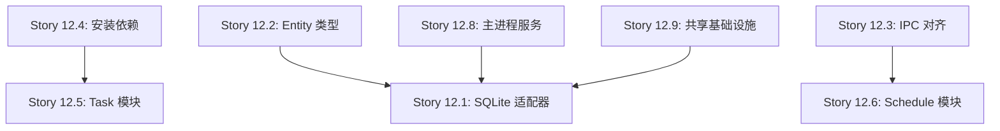

# EPIC-012: 基础设施类型修复

> Created: 2025-01-15  
> Priority: HIGH  
> Estimated: 16-24 hours  
> Status: NOT STARTED

## 背景

在 EPIC-011 Desktop Renderer React 迁移完成后，仍存在约 60 个类型错误分布在以下几个关键区域：

1. **主进程 SQLite 适配器** - 数据库查询返回的 `string` 类型需要转换为对应的枚举类型
2. **缺失的 Entity 类型定义** - 部分 repository 引用了未定义的 Entity 类型
3. **IPC 接口不对齐** - renderer 层期望的 IPC 方法与实际暴露的方法不匹配
4. **缺失的 npm 依赖** - 拖拽相关组件依赖 `@dnd-kit/*` 包未安装
5. **DTO 属性完整性** - 部分 DTO 缺少组件期望的属性

这些问题阻止了 `pnpm exec nx run desktop:typecheck` 的成功执行，需要系统性修复。

## 目标

| Goal | Description |
|------|-------------|
| 类型安全 | 消除所有 `any` 类型和隐式类型错误 |
| 枚举一致性 | 确保数据库字符串正确映射到 TypeScript 枚举 |
| 接口对齐 | 确保 IPC 接口在主进程和渲染进程完全一致 |
| 零 TypeScript 错误 | `nx run desktop:typecheck` 成功通过 |

## 技术架构

### 错误分类

```
错误总数: ~60
├── 主进程 SQLite 适配器 (12 errors)
│   ├── notification.sqlite-repository.ts (6)
│   ├── resource.sqlite-repository.ts (2)
│   ├── notification-template.sqlite-repository.ts (1)
│   ├── repository.sqlite-repository.ts (1)
│   ├── repository-statistics.sqlite-repository.ts (1)
│   └── setting.sqlite-repository.ts (1)
├── 主进程服务层 (7 errors)
│   ├── account/get-profile.ts (1)
│   ├── account/update-profile.ts (1)
│   ├── goal/get-goal-statistics.ts (4)
│   └── goal/update-goal.ts (1)
├── 渲染进程 Task 模块 (18 errors)
│   ├── DraggableTaskCard.tsx (2) - @dnd-kit 缺失
│   ├── TaskManagementView.tsx (11)
│   ├── TemplateSelectionDialog.tsx (2)
│   ├── TaskDetailDialog.tsx (1)
│   └── hooks/stores (2)
├── 渲染进程 Schedule 模块 (5 errors)
│   └── scheduleStore.ts (5)
├── 渲染进程 Reminder 模块 (4 errors)
│   ├── ReminderTemplateCard.tsx (2)
│   ├── TemplateMoveDialog.tsx (1)
│   └── ReminderDesktopView.tsx (1)
├── 共享基础设施 (5 errors)
│   ├── containers/index.ts (3)
│   └── database/index.ts (2)
└── 其他 (9 errors)
    ├── RegisterView.tsx (1)
    ├── useVirtualList.ts (1)
    ├── ipc/index.ts (1)
    ├── autoLaunchManager.ts (1)
    └── list-templates.ts (1)
```

---

## Stories

### Story 12.1: SQLite 适配器枚举类型转换

**目标**: 修复所有 SQLite repository 中 string → enum 的类型转换问题

**文件清单**:

| File | Error | Solution |
|------|-------|----------|
| `notification.sqlite-repository.ts` | string → NotificationType | 添加 `as NotificationType` 类型断言或 helper 函数 |
| `notification.sqlite-repository.ts` | string → NotificationCategory | 同上 |
| `notification.sqlite-repository.ts` | string → ImportanceLevel | 同上 |
| `notification.sqlite-repository.ts` | string → UrgencyLevel | 同上 |
| `notification.sqlite-repository.ts` | string → NotificationStatus | 同上 |
| `notification.sqlite-repository.ts` | string → RelatedEntityType | 同上 |
| `resource.sqlite-repository.ts` | string → ResourceType | 同上 |
| `resource.sqlite-repository.ts` | string → ResourceStatus | 同上 |

**实现方案**:
```typescript
// 创建通用的类型转换辅助函数
function asEnumValue<T extends Record<string, string>>(
  enumType: T,
  value: string
): T[keyof T] {
  return value as T[keyof T];
}

// 或在 mapper 函数中直接断言
private mapToEntity(row: NotificationRow): Notification {
  return {
    ...row,
    type: row.type as NotificationType,
    category: row.category as NotificationCategory,
    // ...
  };
}
```

**验收标准**:
- [ ] `notification.sqlite-repository.ts` 无类型错误
- [ ] `resource.sqlite-repository.ts` 无类型错误
- [ ] 添加运行时验证确保数据库值有效

---

### Story 12.2: 缺失 Entity 类型定义

**目标**: 创建或导出缺失的 Entity 类型

**文件清单**:

| File | Missing Type | Solution |
|------|--------------|----------|
| `notification-template.sqlite-repository.ts` | `NotificationTemplateEntity` | 在 domain 层定义或使用现有的 `NotificationTemplate` |
| `repository.sqlite-repository.ts` | `RepositoryEntity` | 同上 |
| `repository-statistics.sqlite-repository.ts` | `RepositoryStatisticsEntity` | 同上 |
| `setting.sqlite-repository.ts` | `SettingEntity` | 同上 |

**实现方案**:
1. 检查是否已有对应的 domain 类型
2. 如果有，创建 type alias: `type NotificationTemplateEntity = NotificationTemplate`
3. 如果没有，在 `packages/contracts/src/types/entities/` 定义

**验收标准**:
- [ ] 所有 Entity 类型已定义并正确导出
- [ ] Repository 文件无 "Cannot find name" 错误

---

### Story 12.3: IPC 接口对齐

**目标**: 确保 renderer 层的 IPC 调用与 main 层暴露的接口一致

**文件清单**:

| File | Error | Solution |
|------|-------|----------|
| `scheduleStore.ts` | `getByDateRange` 不存在于 ScheduleIPC | 在 ScheduleIPC 添加该方法或修改 store 使用现有方法 |
| `scheduleStore.ts` | create/update 返回类型是 unknown | 修复 IPC handler 的返回类型声明 |
| `ipc/index.ts` | `getLazyIpcHandler` 未导出 | 导出或修复导入 |

**实现方案**:
1. 审计 `ScheduleIPC` 接口定义
2. 添加缺失的方法或修改调用方
3. 确保 IPC handler 正确声明返回类型

**验收标准**:
- [ ] `scheduleStore.ts` 无类型错误
- [ ] IPC 类型在 main 和 renderer 完全同步

---

### Story 12.4: 安装缺失的 npm 依赖

**目标**: 安装 `@dnd-kit/*` 拖拽库相关依赖

**依赖清单**:

| Package | Version | Usage |
|---------|---------|-------|
| `@dnd-kit/core` | latest | 拖拽核心库 |
| `@dnd-kit/sortable` | latest | 可排序列表 |
| `@dnd-kit/utilities` | latest | 工具函数 |

**命令**:
```bash
cd apps/desktop && pnpm add @dnd-kit/core @dnd-kit/sortable @dnd-kit/utilities
```

**验收标准**:
- [ ] `DraggableTaskCard.tsx` 无模块未找到错误
- [ ] 拖拽功能正常工作

---

### Story 12.5: Task 模块类型修复

**目标**: 修复 Task 模块中的所有类型错误

**文件清单**:

| File | Error | Solution |
|------|-------|----------|
| `TaskManagementView.tsx` | `taskStore` 导出错误 | 修改为 `useTaskStore` |
| `TaskManagementView.tsx` | 缺少 `DELETED` 状态 | 添加到 Record 类型 |
| `TaskManagementView.tsx` | `status` 不在 UpdateTaskTemplateRequest | 移除或添加到 DTO |
| `TaskManagementView.tsx` | `emptyState` 可能 undefined | 添加可选链或断言 |
| `TemplateSelectionDialog.tsx` | `estimatedTime` 不存在 | 添加到 TaskTemplateClientDTO 或移除使用 |
| `TaskDetailDialog.tsx` | TimeEstimationCard 模块未找到 | 创建组件或修复路径 |
| `TaskInfoCard.tsx` | UrgencyLevel 与 "None" 比较 | 使用正确的枚举值 |
| `TaskCard.tsx` | 同上 | 同上 |
| `useTaskDependency.ts` | `taskStore` 导出错误 | 修改为 `useTaskStore` |
| `views/index.ts` | TaskCard/TaskCreateDialog 路径错误 | 修复相对路径 |
| `TaskListView.tsx` | TaskDependencyGraphProps 类型错误 | 修复 props 传递 |

**验收标准**:
- [ ] Task 模块所有组件无类型错误
- [ ] Store 导出正确
- [ ] 组件路径正确

---

### Story 12.6: Schedule 模块类型修复

**目标**: 修复 Schedule 模块的 store 和 IPC 类型问题

**详见 Story 12.3 IPC 对齐部分**

**验收标准**:
- [ ] scheduleStore.ts 无类型错误

---

### Story 12.7: Reminder 模块类型修复

**目标**: 修复 Reminder 模块的类型错误

**文件清单**:

| File | Error | Solution |
|------|-------|----------|
| `ReminderTemplateCard.tsx` L327/L335 | number → string/Date | 转换时间戳格式 |
| `TemplateMoveDialog.tsx` L198 | string → Color | 使用正确的 Color 类型 |
| `ReminderDesktopView.tsx` L179 | 返回类型不匹配 UpcomingData | 修复数据结构 |

**验收标准**:
- [ ] Reminder 模块所有组件无类型错误

---

### Story 12.8: 主进程服务层修复

**目标**: 修复 Account 和 Goal 服务的类型错误

**文件清单**:

| File | Error | Solution |
|------|-------|----------|
| `account/get-profile.ts` | `profile` 属性不存在 | 检查 Output 类型定义 |
| `account/update-profile.ts` | 同上 | 同上 |
| `goal/get-goal-statistics.ts` | `findByAccount` → `findByAccountUuid` | 修正方法名 |
| `goal/get-goal-statistics.ts` | 参数隐式 any | 添加类型注解 |
| `goal/update-goal.ts` | `uuid` 重复指定 | 移除重复属性 |

**验收标准**:
- [ ] Account 服务无类型错误
- [ ] Goal 服务无类型错误

---

### Story 12.9: 共享基础设施修复

**目标**: 修复 shared/infrastructure 的模块路径问题

**文件清单**:

| File | Error | Solution |
|------|-------|----------|
| `containers/index.ts` | 找不到 `../../main/di` | 修复路径或条件导入 |
| `database/index.ts` | 找不到 `../../main/database` | 同上 |

**实现方案**:
这些文件可能是为 main process 设计但放在了 shared 目录，需要：
1. 移动到正确的位置，或
2. 使用条件导入/动态导入，或
3. 创建合适的抽象层

**验收标准**:
- [ ] shared/infrastructure 无模块未找到错误

---

### Story 12.10: 其他零散修复

**目标**: 修复剩余的零散类型错误

**文件清单**:

| File | Error | Solution |
|------|-------|----------|
| `RegisterView.tsx` | RegisterInput 类型不匹配 | 添加缺失属性或修改输入 |
| `useVirtualList.ts` | RefObject 类型 | 修复 null 处理 |
| `autoLaunchManager.ts` | auto-launch 无类型声明 | 安装 @types 或创建声明文件 |
| `list-templates.ts` | 参数类型不兼容 | 修复类型或添加默认值 |

**验收标准**:
- [ ] 所有文件无类型错误

---

## 依赖关系



## 实施顺序建议

1. **第一批 (基础)**:
   - Story 12.4: 安装依赖
   - Story 12.2: Entity 类型定义

2. **第二批 (主进程)**:
   - Story 12.1: SQLite 适配器
   - Story 12.8: 主进程服务

3. **第三批 (接口)**:
   - Story 12.3: IPC 对齐
   - Story 12.9: 共享基础设施

4. **第四批 (渲染进程)**:
   - Story 12.5: Task 模块
   - Story 12.6: Schedule 模块
   - Story 12.7: Reminder 模块

5. **最后**:
   - Story 12.10: 零散修复

## 验收标准

- [ ] `pnpm exec nx run desktop:typecheck` 成功通过 (0 errors)
- [ ] `pnpm exec nx run desktop:build` 成功构建
- [ ] 所有单元测试通过
- [ ] 应用可正常启动和运行

## 风险与注意事项

1. **枚举转换风险**: 数据库可能存储了无效的枚举值，需要添加运行时验证
2. **IPC 接口变更**: 修改 IPC 接口可能影响现有功能，需要充分测试
3. **Entity 类型**: 确保新增的 Entity 类型与现有 domain 类型保持一致
4. **共享代码**: shared/infrastructure 的路径问题可能涉及架构调整

---

## 相关文档

- [EPIC-011: Desktop Renderer React 迁移](./EPIC-011-DESKTOP-RENDERER-REACT-MIGRATION.md)
- [ADR-007: 前端统一类型模式](../architecture/adr/ADR-007-FRONTEND-UNIFIED-TYPE-PATTERN.md)
- [packages-contracts.md](../packages-contracts.md)
