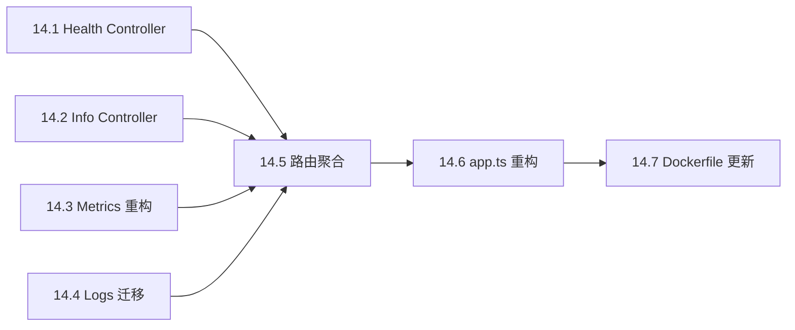

# EPIC-014: 基础设施路由重构

> Created: 2025-12-22  
> Priority: MEDIUM  
> Estimated: 4-6 hours  
> Status: IN PROGRESS

## 背景

当前 API 应用中，所有路由（包括基础设施端点如 `/health`）都挂载在 `/api` 或 `/api/v1` 路径下。这种设计存在以下问题：

1. **版本混淆** - Health check 等基础设施接口不应该受版本控制影响
2. **K8s 不兼容** - Kubernetes 期望标准路径如 `/healthz`、`/readyz`
3. **关注点混合** - 业务 API 和运维接口混在一起
4. **监控配置复杂** - 需要追踪版本变化来配置探针

### 行业标准参考

| 项目 | 模式 |
|------|------|
| **Kubernetes** | `/healthz`, `/readyz`, `/livez`, `/metrics` |
| **Spring Boot Actuator** | `/actuator/health`, `/actuator/info`, `/actuator/metrics` |
| **NestJS Terminus** | `/health`, `/health/database`, `/health/redis` |
| **Express Gateway** | `/__admin/health`, `/__admin/status` |

## 目标

| Goal | Description |
|------|-------------|
| **K8s 兼容** | 提供标准的 `/healthz`, `/readyz`, `/livez` 端点 |
| **关注分离** | 基础设施路由与业务 API 完全分离 |
| **可观测性** | 提供 `/info`, `/metrics` 端点用于运维监控 |
| **零认证** | 基础设施端点不走认证中间件 |
| **高性能** | 健康检查响应 <10ms |

## 技术架构

### 路由重构前后对比

```
重构前:
/api/health          ← 与业务 API 混在一起
/api/v1/health
/api/logs            ← 日志上报
/api/v1/metrics/performance  ← 需要认证

重构后:
/                    ← 基础设施路由 (无版本、无认证)
├── /healthz         ← Liveness probe (存活检查)
├── /readyz          ← Readiness probe (就绪检查)
├── /livez           ← K8s 1.16+ 兼容
├── /info            ← 版本、构建信息
├── /metrics         ← Prometheus 格式指标
└── /logs            ← 前端日志上报

/api/v1              ← 业务 API (版本化、需认证)
├── /tasks
├── /goals
├── /reminders
└── ...
```

### 文件结构

```
apps/api/src/shared/infrastructure/http/
├── controllers/
│   ├── health.controller.ts      ← 健康检查逻辑
│   ├── info.controller.ts        ← 版本信息
│   └── index.ts
├── routes/
│   ├── infrastructureRoutes.ts   ← 基础设施路由聚合
│   └── crossModuleRoutes.ts      ← 现有跨模块路由
└── middlewares/
    └── ...
```

---

## Stories

### Story 14.1: 创建健康检查控制器

**目标**: 实现分层健康检查逻辑

**文件**: `apps/api/src/shared/infrastructure/http/controllers/health.controller.ts`

**实现要点**:

| 端点 | 功能 | 响应时间目标 |
|------|------|-------------|
| `/healthz` | 存活检查 - 进程在就返回 ok | <5ms |
| `/readyz` | 就绪检查 - 检查数据库等依赖 | <50ms |
| `/livez` | 别名，与 healthz 相同 | <5ms |

**响应格式**:

```typescript
// Liveness (简单)
{ "status": "ok" }

// Readiness (详细)
{
  "status": "ok" | "degraded",
  "checks": {
    "database": { "status": "ok", "latencyMs": 12 },
    "cache": { "status": "ok", "latencyMs": 3 }
  },
  "timestamp": "2025-12-22T10:00:00.000Z"
}
```

**验收标准**:
- [ ] `/healthz` 响应 < 5ms
- [ ] `/readyz` 检查数据库连接
- [ ] 依赖不可用时返回 503 状态码

---

### Story 14.2: 创建应用信息控制器

**目标**: 提供版本和构建信息端点

**文件**: `apps/api/src/shared/infrastructure/http/controllers/info.controller.ts`

**响应格式**:

```typescript
{
  "name": "@dailyuse/api",
  "version": "0.1.0",
  "environment": "production",
  "nodeVersion": "v22.x.x",
  "uptime": 3600,
  "build": {
    "timestamp": "2025-12-22T08:00:00.000Z",
    "commit": "abc1234"
  }
}
```

**验收标准**:
- [ ] 返回 package.json 中的版本信息
- [ ] 包含运行时环境信息
- [ ] 包含进程启动时间

---

### Story 14.3: 重构 Metrics 端点

**目标**: 将性能指标端点移至基础设施路由，支持 Prometheus 格式

**当前位置**: `/api/v1/metrics/performance` (需要认证)

**新位置**: `/metrics` (无需认证，或通过 IP 白名单保护)

**响应格式选项**:

```
# Prometheus 格式
http_request_duration_seconds_bucket{method="GET",path="/api/v1/tasks",le="0.1"} 150
http_request_duration_seconds_bucket{method="GET",path="/api/v1/tasks",le="0.5"} 180
http_request_duration_seconds_sum{method="GET",path="/api/v1/tasks"} 45.2
http_request_duration_seconds_count{method="GET",path="/api/v1/tasks"} 200
```

**验收标准**:
- [ ] `/metrics` 返回 Prometheus 兼容格式
- [ ] 包含请求延迟直方图
- [ ] 包含请求计数

---

### Story 14.4: 迁移日志上报端点

**目标**: 将客户端日志上报从业务 API 移至基础设施路由

**当前位置**: `/api/logs`

**新位置**: `/logs`

**理由**: 前端崩溃前的错误日志收集不应该依赖版本化的 API

**验收标准**:
- [ ] `/logs` 端点正常工作
- [ ] 不需要认证
- [ ] 限流保护（防止滥用）

---

### Story 14.5: 创建基础设施路由聚合

**目标**: 创建统一的基础设施路由模块

**文件**: `apps/api/src/shared/infrastructure/http/routes/infrastructureRoutes.ts`

**路由表**:

| 路径 | 方法 | 处理器 | 说明 |
|------|------|--------|------|
| `/healthz` | GET | healthController.liveness | K8s liveness probe |
| `/readyz` | GET | healthController.readiness | K8s readiness probe |
| `/livez` | GET | healthController.liveness | K8s 1.16+ 兼容 |
| `/info` | GET | infoController.getInfo | 应用信息 |
| `/metrics` | GET | metricsController.getPrometheus | Prometheus 指标 |
| `/logs` | POST | logsController.capture | 客户端日志上报 |

**验收标准**:
- [ ] 所有端点可通过根路径访问
- [ ] 不经过认证中间件
- [ ] 不经过压缩中间件（SSE 和健康检查）

---

### Story 14.6: 重构 app.ts

**目标**: 更新主应用文件，分离基础设施和业务路由

**改动点**:

1. 创建 `infraRouter` 挂载到 `/`
2. 保持 `apiRouter` 挂载到 `/api/v1`
3. 移除 `/api` 的向后兼容挂载（或保留一段时间后废弃）
4. 移除 `/api/logs` 路由（移至基础设施）

**验收标准**:
- [ ] `/healthz` 返回 200
- [ ] `/api/v1/tasks` 需要认证
- [ ] 旧的 `/api/health` 返回重定向或 404

---

### Story 14.7: 更新 Dockerfile

**目标**: 更新健康检查配置使用新路径

**当前配置**:
```dockerfile
HEALTHCHECK ... CMD ... 'http://localhost:3000/health'
```

**新配置**:
```dockerfile
HEALTHCHECK ... CMD ... 'http://localhost:3000/healthz'
```

**验收标准**:
- [ ] Docker 健康检查正常工作
- [ ] 容器启动后 30s 内变为 healthy

---

## 实现顺序



## 风险和缓解

| 风险 | 影响 | 缓解措施 |
|------|------|----------|
| 现有监控脚本使用旧路径 | 监控中断 | 保留旧路径一段时间，返回 301 重定向 |
| 前端日志上报使用旧路径 | 日志丢失 | 前端同步更新或保留旧路径 |
| Metrics 公开可能泄露信息 | 安全风险 | 考虑 IP 白名单或 basic auth |

## 测试计划

### 单元测试

- [ ] `health.controller.test.ts` - 健康检查逻辑
- [ ] `info.controller.test.ts` - 信息端点

### 集成测试

- [ ] 所有基础设施端点可访问性
- [ ] 认证中间件不影响基础设施路由
- [ ] Docker 健康检查集成

### 手动测试

```bash
# Liveness
curl http://localhost:3000/healthz

# Readiness  
curl http://localhost:3000/readyz

# Info
curl http://localhost:3000/info

# Metrics
curl http://localhost:3000/metrics

# Logs
curl -X POST http://localhost:3000/logs -H "Content-Type: application/json" -d '{"logs":[]}'
```

---

## 参考资源

- [Kubernetes Probes Best Practices](https://kubernetes.io/docs/tasks/configure-pod-container/configure-liveness-readiness-startup-probes/)
- [Spring Boot Actuator](https://docs.spring.io/spring-boot/docs/current/reference/html/actuator.html)
- [Prometheus Metrics Format](https://prometheus.io/docs/instrumenting/exposition_formats/)
- [NestJS Terminus](https://docs.nestjs.com/recipes/terminus)
